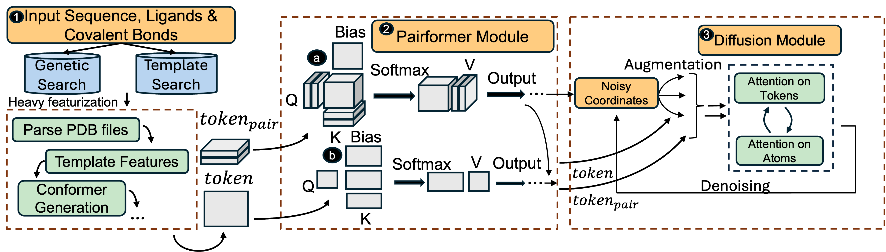
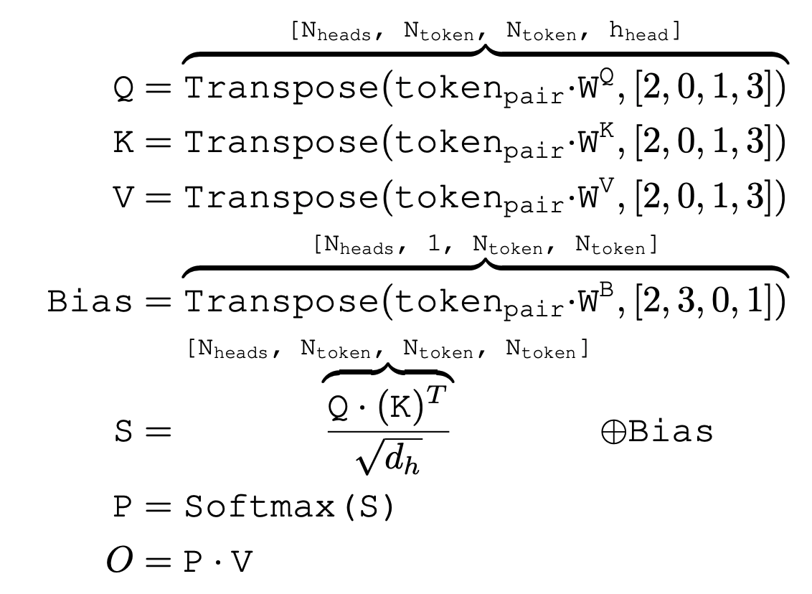
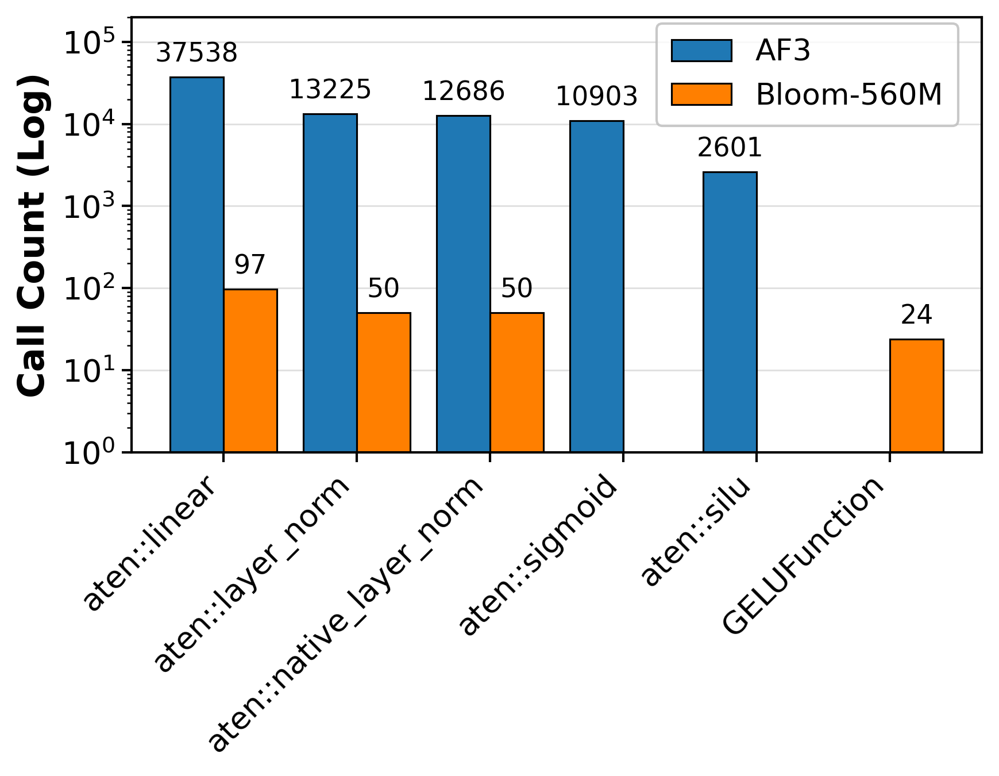
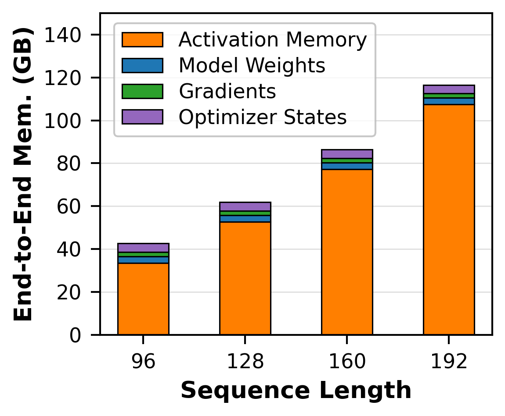
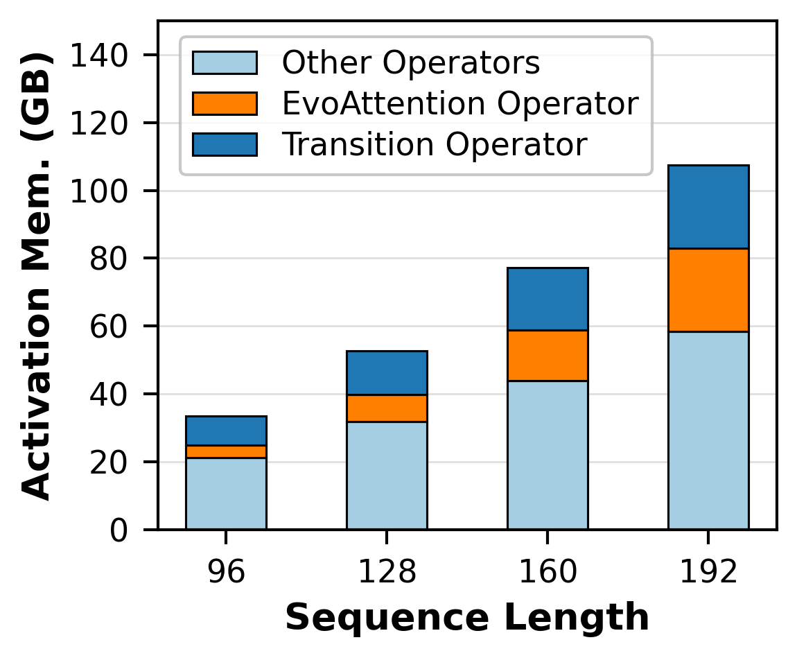
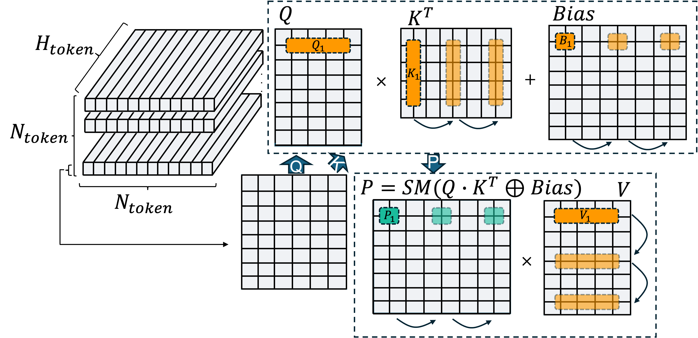
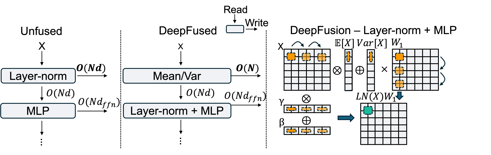
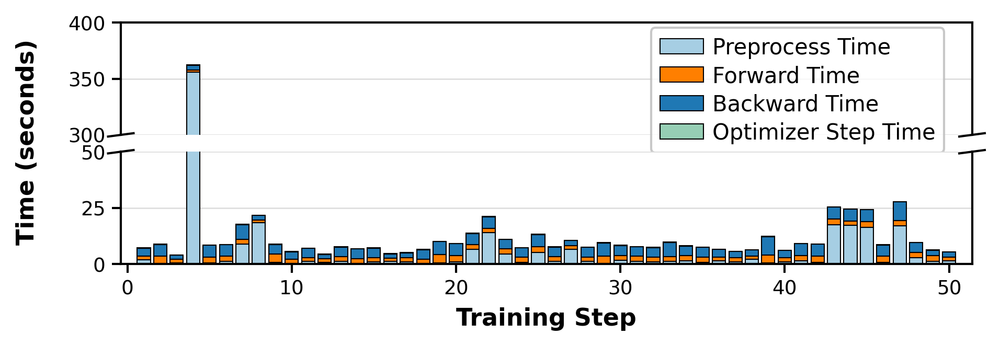
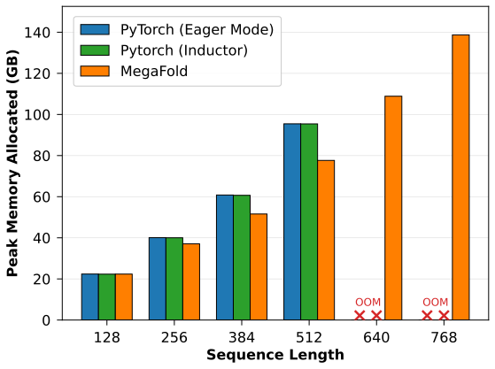
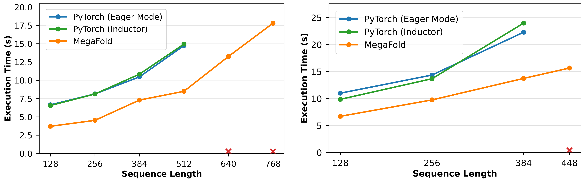

* * *

The structure of a protein, also known as how a “protein folds”, determines how it binds with other proteins with vast reaching implications to: drug design, disease treatment, and vaccine development. However, predicting its precise 3D structure has historically been very hard. That is, until the inception of Alpha-Fold 3, the latest advancement in protein-structure prediction by Google DeepMind. Alpha-Fold 3 is capable of predicting the 3D coordinates of a protein's constituent atoms with atomic-level fidelity. It's so accurate that the creators won the Chemistry Nobel Laureate this year.

Given its importance, we wanted to investigate how effective current techniques are in training Alpha-Fold 3 (AF3), and spoiler alert: we found out they weren't as effective as they should be. How did we come to that conclusion? Through simple benchmarking. The Alpha-Fold family of models are moderately sized, with Alpha-fold 3 coming out the top at ~500M parameters. However, compared to size-equivalent transformers, e.g. BLOOM-560M, AF3 is an *order of magnitude* slower per training-iteration, whilst permitting training on an *order of magnitude* shorter input contexts (in fact AF3 can only train on ~380 tokens on a single GPU despite its moderate parameter count).

This begged the question, what's going on? In this post, we uncover why exactly it's so difficult to train AF models (especially AF-3) and propose a bunch of novel optimisations that significantly increase both the speed and trainability of AF-3 models. Specifically:

1. We investigate the model architecture of AF-3 and uncover two issues that elongate training times and cause memory explosions: (1) Complex retrieval augmented data-pipelines, and (2) Frequently launched compute and memory heavy operators.
2. We propose a set of optimisations that target uncovered bottlenecks, culminating in a new system: MegaFold, which significantly accelerates AF-3 training whilst consuming less memory. MegaFold consists of low-level Triton kernels as well as system optimizations that synergistically work together to tackle some of the issues we've uncovered. In writing our kernels in Triton, we hoped that our system would be performanc portable, a nice benefit in an age with many GPU hardware options.

## The AF-3 Model - Brief Overview

AF-3's architecture deviates significantly from the transformer architecture proposed in 2017 [1] as a consequence of solving a targeted scientific problem, rather than building a general purpose language model. We term these modifications “science-informed” architectural changes as they leverage domain specific information to boost model quality. We go over AF-3's architecture and highlight its modifications to the transformer. These modifications are primarily the reason for slow training times and memory explosions. If you are already familiar with AF-3 feel free to skip this section.

AF-3 consists of three sections: (1) Data loading & Preprocessing, (2) Pairformer module (consisting primarily of attention), (3) Diffusion Module (which is responsible for predicting the 3-D output coordinates of the input biological complex).

**Data-loading and Preprocessing.** AF-3 has a unique data loading and preprocessing pipeline that augments the input biological complex with relevant information acquired from a database to assist in protein structure prediction. It prepares two sets of inputs: token-level ($\texttt{token}$) and token-pair ($\texttt{token}_{\text{pair}}$) representations. The pipeline first works by decomposing the input complex into atomic-level features, aggregating them into the $\texttt{token}$ representation that is $[N_{\text{token}}, N_{\text{token}}, h_{\text{dim}}]$-sized. It then models how these tokens interact with each other, by aggregating evolutionary information from similarly retrieved complexes from databases such as the Protein-Databank (PDB) and forming the $\texttt{token}_{\text{pair}}$ representation that is $[N_{\text{token}}, N_{\text{token}}, h_{\text{dim}}]$-sized. Unlike transformers which only build a single tokenized version of the input, AF-3 builds 2 sets of inputs, one of which is quadratic. Many layers in AF-3 operate on the quadratic set of inputs which in turn elongates runtime and increases size of activation memory produced.

**Pairformer Module.** The pairformer module further processes the prepared $\texttt{token}$ & $\texttt{token}_{\text{pair}}$ representations via 1-D and 2-D Evolutionary-Attention operators. We use the term Evolutionary-Attention to encompass all the attention operators within AF-3, some of which aggregate pairwise evolutionary information.

A key difference from the multi-head-self-attention operator in transformers is that 2-D Evo-Attention produces cubic logits with an additional additive learnt bias over the attention weights. We describe the full form:

**Structured Diffusion Module.** Finally, the processed output of the Pairformer module is fed into the diffusion module which predicts the 3-D coordinates of each constituent atom in space. It consists of two key architectural innovations. (1) To enforce robustness to translation and rotations, the input complex is randomly rotated and translated producing newer data that is augmented with the input complex by enlarging its batch-size (usually by 48x). (2) A denoising decoder that consists of several layers including: Evolutionary-Attention and Transition layers (the AF-3 equivalent of transformer MLP layers).

To summarize, AF-3 introduces many novel science informed architectural changes such as:
1. Attention on 2-D token pairs. By performing self-attention on token pairs, a more robust pairwise representation is learnt, inducing better modeling ability. However, memory complexity now becomes cubic, as opposed to quadratic in transformer MHSA.
2. The introduction of a structured diffusion module to generate the 3-D coordinates of constituent atoms, alongside novel operators within it such as transition layers (equivalent to the MLP in transformers), adaptive layer-normalizations and layer-normalizations.
3. Data-agumentation, where input coordinates are randomly rotated and translated to enforce equivariance, replicating the input batch size (usually by 48x).
4. Retrieving similar protein templates to the one in question to undergo Multiple-Sequence-Alignment, a biological technique that is used to augment the input sequence with additional helpful information.

Each new innovation invalidates many of the uncovered optimisations that are effective in the transformer literature.

## Frequent Launching of Compute-and-Memory heavy Operators

We first investigated how many kernels are launched in a single AF-3 training iteration. Digging deeper, we found a surprising result: a typical AF-3 model launches 100x more compute kernels than a size-equivalent large-language model:

In particular, it calls about ~37k linear layers, ~13k layer-normalizations and ~13k activation functions. Comparatively BLOOM-560M (a popular open-source size-equivalent transformer) calls each kernel less than 100 times.

This is bad for two reasons. (1) each kernel call induces non-negligible launch overhead, slowing down per-iteration training time, (2) each of these function calls needs to store the inputs for computing gradients in the backward pass, causing memory to explode whilst training.

To verify the latter, we further decomposed the memory consumed in an iteration of AF-3 training into four states: model, optimiser, gradient, and activation states at various sequence lengths. Low-and-behold we got the following results:

Illustrating that activation memory indeed consumes roughly 97% of end-to-end memory consumption.

Moreover, another issue exacerbates this: the 2-D pairwise amino-acid representation that enhances quality forces a lot of these operators (attention included) to operate on O(N^2) sized-data. So now we not only have many operators launched requiring their input activations stored for the backward pass, but a lot of these operators operate on O(N^2) data as well!

To verify this, we yet again ran another experiment, this time decomposing what constitutes more than 50% of the activation memory:

As we can see from the above image, EvoAttention rapidly consumes more memory with increasing input sequence lenghts, consuming 3.75GB with 96 tokens and increasing to 24.61GB at 192 tokens. A 6.56x increase in activation memory produced with a mere 2x increase in input token lengths.

## What's the fix?

Now that we've got the main issues out of the way, the question arises, how do we circumvent these memory and compute issues?

Our analysis showed that two frequently launched layers constitute significant memory: 2-D EvoAttention and Transition, both of which have many constituent operators, each of which are sequentially launched to compute the final output of each respective layer. Kernel fusion screamed at us as a solution to some of the previously mentioned problems: frequently launched kernels, as well as high activation memory produced, so that's what we exactly did. We wrote custom fused EvoAttention and Transition layers that selectively wrote a subset of activations to HBM, reducing the number of kernel launches as well as activation memory produced. Each fusion substantially reduces the runtime and memory consumption of AF-3 training, working in tandem to fix some of the previously discussed issues. We detail each fusion next (only the forward pass, for the backward pass feel free to check out our paper).

### Fused EvoAttention

At a high level, EvoAttention works on 2-D amino-acid pairs (not really just amino acids, but for the sake of simplicity, let's stick to this). If we visualise the quadratic logits as a 3-D cube, where the axis are the 2-sequential dimensions and 1 hidden dimension, then attention is independently computed on each plane.

We fuse the attention computation to avoid materializing the intermediate O(N^2) logits per plane (resulting in a total of O(N^2) logits produced, rather than the original O(N^3)). Diagramatically, our fusion looks as follows:

The green boxes mark what a thread-block computes and stores into fast-scratchpad memories and yellow marks what a thread-block loads from memory. Special care must be taken to compute the softmax in an online fashion, since the thread-blocks that compute the intermediate matrix (green in the diagram) sweep through the columns and rescale the final output to ensure it is softmax-normalized.

### Fused Transition Layer

The transition layer is another crucial and memory intensive layer in AF-3, and is the equivalent of the feed-forward layer in the transformer architecture. It consists of a layer-normalization (LN) followed by a 2-layer SwiGLU MLP, replacing the root-mean square normalization in transformers with a layer-normalization.

We propose a fusion that avoids materializing the LNed activations to memory and instead fuses this with the first MLP layer. This cuts down the O(Nd) set of activations stored and instead only stores O(N) activations.

We term this a LN+Linear fusion and it proceeds by launching two kernels. The first kernel computes the expectation and variance per row of the input and stores this into memory. The second kernel computes the layer-normalized inputs and multiplies this with the pertinent MLP weights in one shot, producing the true output of the first MLP layer. Diagrammatically, our fused kernel looks as follows:

### What's special about our fusions?

A good question to ask here is what's so special about the two fusions we proposed? A key insight that we uncovered whilst working on this project is that a lot of work from the compilers/systems domain on kernel fusion focuses on inference, where intermediate activations can be discarded. On the other hand our fusions focus on training and work in tandem to reduce both intermediate activations produced whilst increasing runtime performance. Moreover, we realised that a lot of automated techniques merely focus on scheduled optimisations (such as layout, loop fusion/fission etc…) and/or epilogue/prologue fusion where the output of a complex compute operator is fused with a simple bandwidth operator (such as a RELU function). Our fusions operate on semantically different operators by adjusting their algorithms (e.g. changing the softmax to be online, or mutating inner mat-mul loops to layer-normalize data and multiply by MLP weights). These change the algorithm whilst preserving the core semantics of the operators.

## Another performance Issue - Data Loading

The story doesn't end here. While investigating the performance characteristics of AF-3, we noticed another big bottleneck: the data-loading and preprocessing stage. This pipeline involves retrieving similar complexes with known structures from the Protein Data-Bank to undergo multiple-sequence-alignment (MSA) to augment the input complex with more information. This retrieval step is expensive, consuming anywhere from 1-60 seconds (depending on the number of similar complexes retrieved). We profiled AF-3's data-loader, forward and backward passes across 50 iterations to illustrate the impact of each stage on runtime:

We see that data-loading and preprocessing consumes considerable runtime, above and beyond the collective sum of the forward, backward passes and optimiser steps. This induces periods of GPU idle time since the retrieval step occurs on the CPU.

### Ahead-of-Time Caching

To mitigate this issue, we analyzed the runtime data-dependencies in the data-loading and preprocessing step, segmenting this step into two: (1) cacheable features which are deterministic for each input complex, (2) non-cacheable features which are possibly randomly generated per input complex. We precompute (1) ahead-of-time for our dataset and modify the data-loading step to correctly load from the cache to use for the rest of the preprocessing steps. This significantly reduces end-to-end training time at the cost of generating the cache once ahead of time.

## MegaFold's Performance

Though MegaFold is still under active development, we wanted to share some of the results we get when training AF3. We built MegaFold over AlphaFold-3 PyTorch, an open-sourced training system for AF3. When benchmarking MegaFold's performance, we're primarily interested in two metrics: (1) Trainability - what's the maximum trainable input context length our methods enable? This is important as existing systems permit training on at most ~500 tokens, severely limiting the input size of a protein. (2) Runtime-performance, of course increasing the trainability of a model at the expense of runtime is usually not a good idea, so it's important to check what the per-iteration runtime is.

First, with regards to trainability, we look at the peak memory allocated at various sequence lengths, comparing MegaFold to the AlphaFold-3 PyTorch baseline (compiled via Eager Mode and Inductor). We assessed performance on an NVIDIA H200-141GB GPU.

Notably, we see that MegaFold is the only system capable of training on sequence lengths of 640 and 768, a 1.5x increase in input sequence lengths compared to the baselines. Moreover, MegaFold consistenly has lower peak-memory consumptions across the sequence lengths that the baseline can also train on. Across these sequence lengths, MegaFold reduces peak memory consumption by 1.12x on average.

Next, with regards to runtime-performance, we look at the per-iteration runtime at various sequence lengths. This time, we assessed MegaFold and the baselines on both NVIDIA H200-141GB (left) as well as AMD MI250-64GB GPUs (right) to demonstrate the performance portability of our method.

Luckily, our kernels are well written and engineered to bring about performance. On sequence lengths that both MegaFold and the baseline can train on, MegaFold reduces per-iteration training time by 1.69x and 1.58x on NVIDIA and AMD hardware respectively.

## Acknowledgements

We would like to thank our collaborators: Alex Morehead and Jianlin Cheng for also working with us on this project as well as Phil Wang, for the original AlphaFold-3 PyTorch implementation.

## Code Links and Other Resources

MegaFold is still under active development, however we have open-sourced our code to facilitate open research. The code can be found [here](https://github.com/Supercomputing-System-AI-Lab/MegaFold/).

Additionally, more details and results can be found in our preprint [here](https://arxiv.org/abs/2506.20686).
