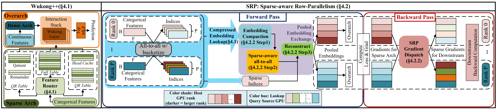
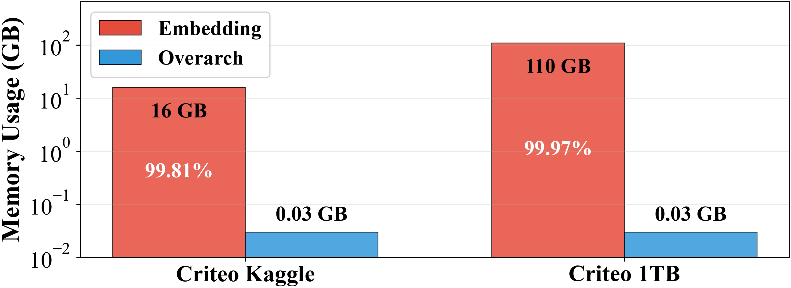
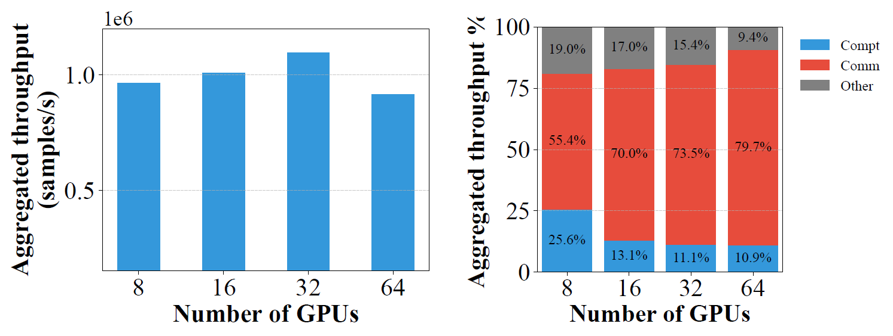
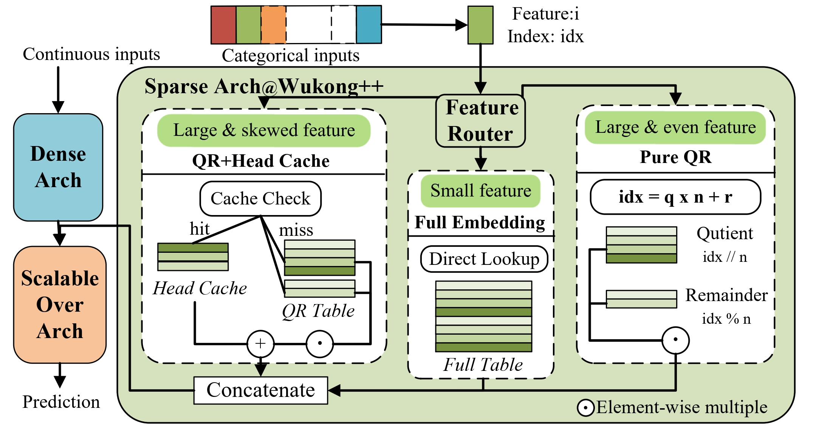
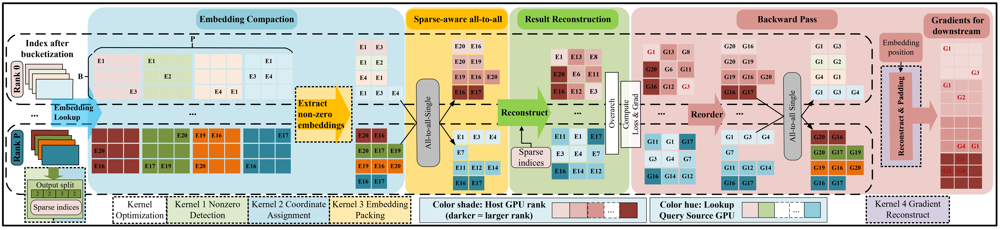
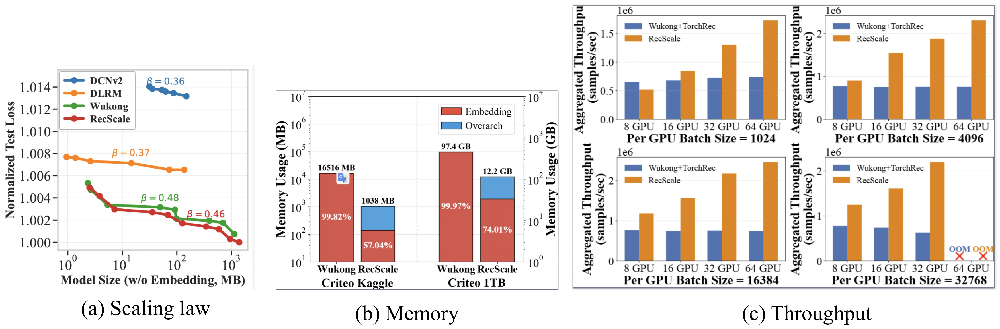
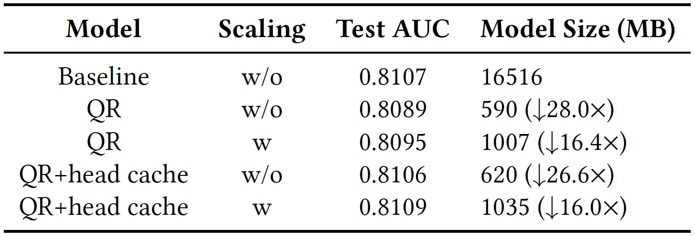
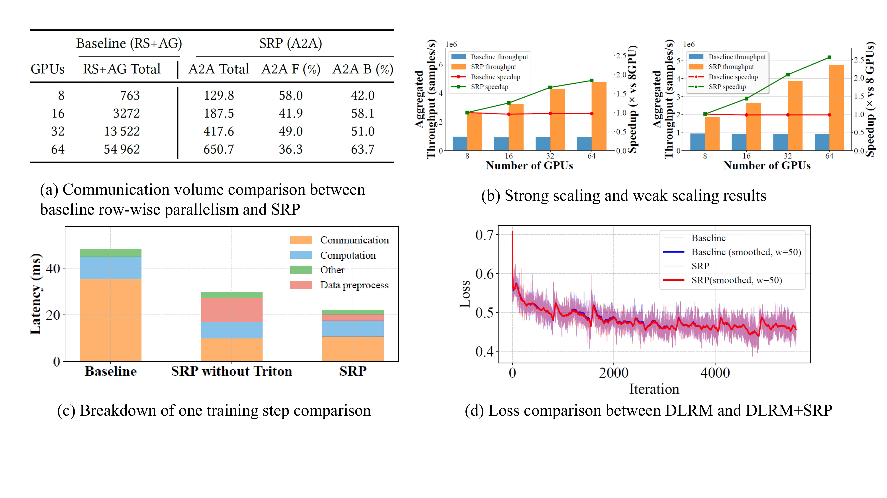

Scaling laws have guided the design of increasingly large machine learning models. For example, scaling laws in NLP, established by OpenAI and others, show that model performance improves predictably with increased parameters and training tokens, motivating the exponential growth of large language models (LLMs). So naturally, this made us wonder: can Deep Learning Recommendation Models (DLRMs) benefit from similar scaling laws? While recent studies have begun characterizing scaling behavior in recommendation systems, they overlook critical system-level constraints—such as communication overhead, memory limitations, and embedding sharding strategies. This is why we built RecScale, a system that extends scaling laws for DLRMs with a system-aware perspective.

At a glance, RecScale achieves up to **16×** memory reduction and **3.31×** end-to-end training speedup on 64 GPUs while preserving both accuracy and scaling-law trends. These results show that DLRMs can continue scaling efficiently once we eliminate memory and communication bottlenecks.

  

## What makes it so hard to scale DLRMs

Through our investigation, we identified two key challenges that hinder further scaling of DLRMs:

**1. Memory Wall from Embedding Tables.**
Unlike LLMs, DLRMs are embedding-heavy—embeddings account for 99% of total parameters in industrial-scale deployments. Even scaling-law-friendly architectures (e.g., the Wukong model) remain fundamentally bottlenecked by the embedding memory wall. This motivates us to reduce embedding memory consumption while explicitly preserving scaling-law behavior.

  

**2. Communication Wall in Row-wise Parallelism.**
The massive embedding tables necessitate distribution across devices using row-wise parallelism. However, conventional implementations based on bucketization and reduce-scatter operations introduce significant communication redundancy and bandwidth constraints during distributed training. This motivates us to optimize communication patterns to enable efficient scalability across multi-node, multi-GPU clusters.

  

These two fundamental challenges—memory and communication bottlenecks—motivated the design of RecScale.

## How do we solve the challenge—RecScale Design

### 1. Wukong++ (Addressing the Memory Wall) 

We introduce Wukong++ to substantially reduce the embedding footprint while preserving scaling-law trends, which enables the freed memory to be reinvested into the overarching architecture. Figure 7 illustrates the Wukong++ framework.

  

**Key components:**

a. **QR-based Embedding Compression:** Apply quotient-remainder hashing to compress large embedding tables using a threshold-based approach, reducing memory footprint while preserving representation quality.

b. **Head Cache Enhancement:** Employ an additional small full-precision embedding cache for features with high frequency and skewed distributions, effectively recovering accuracy loss introduced by compression.

c. **Memory Reinvestment to Overarch:** Leverage the freed memory from compression to scale up the model architecture (inspired by Wukong's scaling capabilities), achieving superior performance with a reduced overall memory footprint.

### 2. SRP (Addressing the Communication Wall) 

We introduce Sparse Row-wise Parallelism (SRP) to eliminate communication redundancy in distributed embedding lookup. SRP achieves this through three key techniques:

  

a. **Embedding Compaction:** Baseline row-wise parallelism pads query buckets to fixed sizes, creating zero-filled buffers that grow with GPU count. SRP extracts only valid embeddings after local lookups and packs them contiguously, recording metadata for communication splits and reconstruction. This eliminates padding overhead while preserving correctness.

b. **Sparse-Aware All-to-All:** Instead of fixed-size reduce-scatter and all-gather operations that transfer zeros, SRP uses variable-sized all-to-all exchanges based on per-peer split sizes. In the forward pass, metadata guides each GPU to scatter received embeddings into correct [B,F,D] positions. In the backward pass, the same metadata maps gradients back to their corresponding rows, ensuring full semantic equivalence to baseline RP without redundant transfers.

c. **Fused Kernel Optimization:** SRP's compaction and reconstruction stages could trigger multiple kernel launches and memory I/O overhead. To amortize these costs, we implement fused Triton kernels that combine nonzero detection, coordinate assignment, packing, and reconstruction into single block-parallel operations. We employ a Block-Aggregated Atomic scheme where each block reserves output segments via prefix-sums rather than individual atomic updates, drastically reducing contention. Gradient filtering and packing are similarly fused in the backward pass, ensuring coalesced memory access and maximizing end-to-end throughput.

## How well does RecScale perform?

### 1. Main Results:

  

**Preserving Scaling-Law Efficiency:** RecScale achieves β=0.46 (scaling efficiency coefficient), closely matching Wukong (β=0.48) and significantly outperforming baseline models, demonstrating efficient scaling under aggressive compression.

**Mitigating Embedding Memory Bottleneck:** Achieves up to 16× memory reduction through embedding compression coupled with overarch expansion, removing embeddings as the dominant bottleneck and enabling larger, more capable models under fixed GPU memory constraints without sacrificing accuracy.

**Throughput and Scalability Gains:** Delivers up to 3.31× speedup on 64 GPUs through sparsity-aware row parallelism that eliminates redundant communication in pooled-embedding exchange *(Figure main result)*.

### 2. Wukong++ Component Analysis

We ablate each component by incrementally enabling QR-based compression, head cache, and overarch scaling. As shown in Table 2, QR compression alone reduces model size by 28× but incurs a 0.2% AUC drop. Adding the head cache recovers this loss—achieving 26.6× compression with near-baseline accuracy. Reinvesting saved memory into the overarch (QR+head cache with scaling) fully restores performance at 16× compression, confirming that the head cache is critical for maintaining accuracy-memory efficiency under aggressive compression.

  

### 3. SRP Communication and Scaling Benefits

a. **Communication Efficiency** *(Table 3)*: SRP drastically reduces communication volume by sending only non-zero embeddings. At 64 GPUs, total traffic drops from 54.9B to 651M tensor elements—a reduction of over 84×—eliminating the replicated padding overhead of traditional reduce-scatter/all-gather.

b. **Scaling Behavior** *(Figure 13)*: In strong scaling (fixed global batch), SRP maintains higher throughput as GPU count increases while the baseline plateaus due to bandwidth limits. In weak scaling (fixed per-GPU batch), SRP sustains near-linear scaling, consistently outperforming the baseline even at large GPU counts.

c. **Kernel Optimization** *(Figure 14)*: SRP's fused Triton kernels reduce preprocessing overhead by over 70% by merging nonzero detection, packing, and reconstruction into single efficient operations, ensuring communication savings aren't offset by compute costs.

d. **Correctness Validation** *(Figure 15)*: Loss curves on the Criteo dataset match the baseline identically, confirming SRP preserves training semantics while optimizing data movement.

  

* * *

<!-- 

[1] Radosvet Desislavov, Fernando Martínez-Plumed, José Hernández-Orallo, "Trends in AI inference energy consumption: Beyond the performance-vs-parameter laws of deep learning," Sustainable Computing: Informatics and Systems, Volume 38, 2023. <a href="https://doi.org/10.1016/j.suscom.2023.100857" target="_blank" rel="noopener">DOI: 10.1016/j.suscom.2023.100857</a> [↩](#ref1)

[2] Esha Choukse et al., "Power Stabilization for AI Training Datacenters," 2025. <a href="https://arxiv.org/abs/2508.14318" target="_blank" rel="noopener">arXiv:2508.14318</a> [↩](#ref2)

[3] Cooper Elsworth et al., "Measuring the environmental impact of delivering AI at Google Scale," 2025. <a href="https://arxiv.org/abs/2508.15734" target="_blank" rel="noopener">arXiv:2508.15734</a> [↩](#ref3)

 -->

<!-- * * * -->

