

Why is energy-efficient LLM serving important but hard?
-------------------------------------------------------

Large Language Models (LLMs) have become the backbone of modern AI services—chatbots, coding assistants, agent pipelines—but their **energy footprint is massive[[2]](#ref2),[[3]](#ref3)**. Inference alone can account for **90%+ of AI infrastructure utilization**[[1]](#ref1), pushing datacenter power and cooling limits. For context, large datacenters already draw power equivalent to millions of households.

At the same time, LLMs are increasingly used in **latency-sensitive applications**, where violating SLOs like Time-to-First-Token (TTFT) or Inter-Token Latency (ITL) degrades user experience. This creates a difficult tension: **Can we even save energy without harming the SLO guarantees?**

We started by profiling LLM inference on NVIDIA A100s, expecting the usual tradeoff: lower frequency saves energy at the cost of latency. But our experiments told a different story.

* * *

Key observations
----------------

We discuss our key observations here which will build the foundation of our insights and consequently our design. These observations helped us build VoltanaLLM as an efficient and adaptive system.

### 1\. **U-shaped energy-frequency curves**

Instead of energy monotonically dropping with frequency, we saw a **U-shaped relationship**:

*   At **low frequencies**, execution time dominates, so energy-consumption (power x time) rises fast.
*   At **high frequencies**, power dominates as it increases hyper-linearly with frequency, raising the energy consumption again.
*   In the middle lies a **sweet spot**—but its exact location differs for varying hardware, workloads, and even **prefill** (compute-heavy) vs. **decode** (memory-heavy) phases.

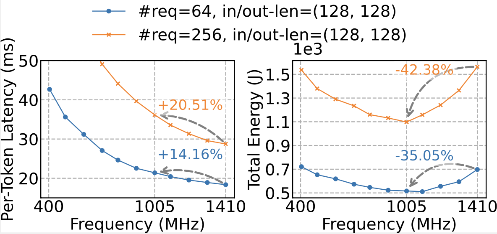

### 2\. **Temporal variation in prefill vs. decode demand**

Using the Azure LLM Inference Trace 2024, we found that real workloads don’t stay balanced. This is also previously studied for a variety of applications that observe diurnal variation in demand on the internet.

*   **Conversation requests** → stable decode demand.
*   **Code requests** → strong diurnal variation, peaking in afternoons, with shorter decodes.
*   Overall → the **prefill/decode ratio skews dynamically over time**, meaning a one-size-fits-all frequency policy is inefficient.

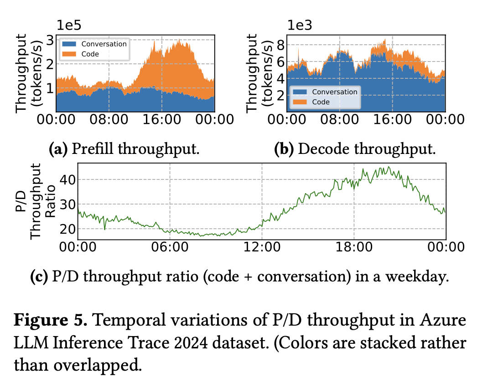

### 3\. **Batch size boundaries create inefficiency**

GPUs do not scale workload efficiency smoothly as batch sizes increase. When a batch crosses certain thresholds (for example, from 128 to 129 requests), the hardware can no longer keep all of its processing units fully occupied. Even though some units sit idle, the GPU still expends a full cycle of computation, which shows up as **staircase-like jumps** in both inter-token latency (ITL) and energy-per-token (EPOT). This is a bit like a bus leaving the station half empty but still burning the same fuel for the trip. The effect is most pronounced during the _decode phase_, where batches are smaller and more frequently hover near these thresholds, making the inefficiency much more visible than in prefill.

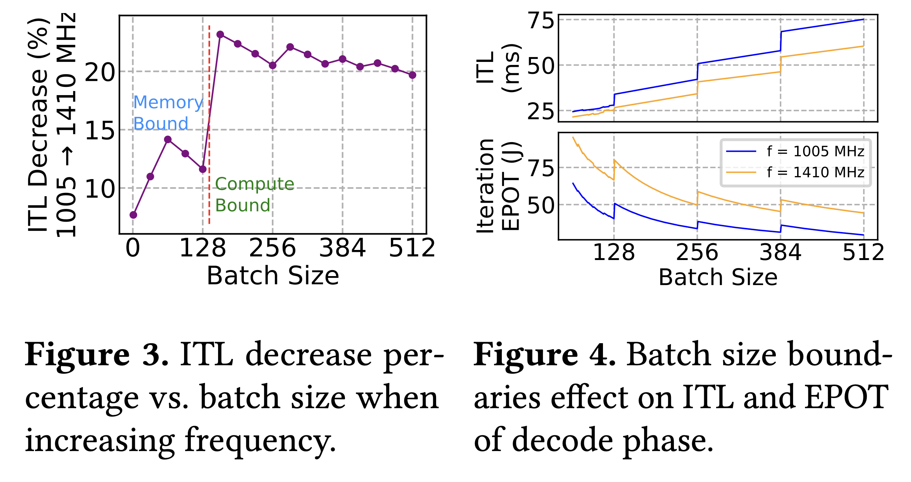

_Takeaway:_ Energy efficiency in LLM serving isn’t just about lowering GPU frequency. It requires **phase-aware, adaptive control** that can handle workload variation and hardware quirks.

* * *

The VoltanaLLM design
---------------------

VoltanaLLM is built on top of prefill/decode (P/D) disaggregation architectures (supported in engines like SGLang and vLLM), which naturally separate the two phases onto different GPU instances. This separation is key: it lets us apply **phase-specific optimizations which get surpressed in traditional serving due to distinct and interfering properties of the prefill and decode phases.**.

VoltanaLLM introduces three core components:

### 1\. EcoFreq: **Feedback-driven frequency controller from a control theory perspective**

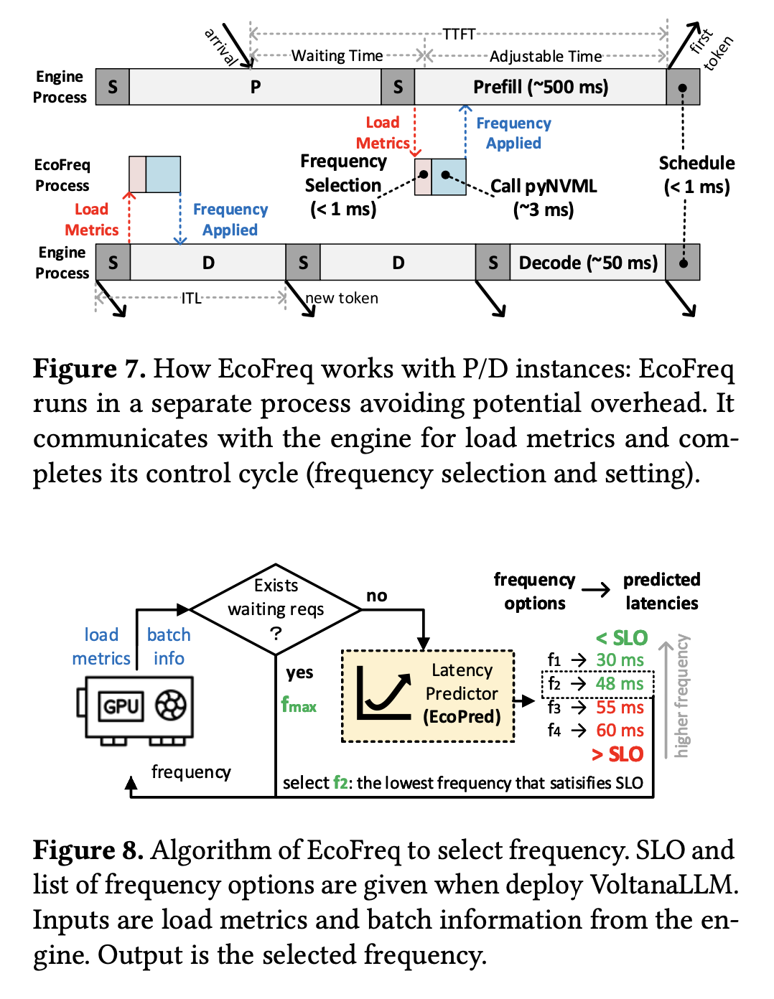

*   Runs a lightweight control loop inspired from control theory (<4 ms).
*   Adjusts GPU frequency per batch, using load metrics and latency predictions.
*   Selects the lowest safe frequency that satisfies SLOs.
*   Handles prefill differently from decode (accounts for waiting time in queues for TTFT).
*   Uses **pyNVML** instead of **nvidia-smi**, avoiding the usual larger overhead.

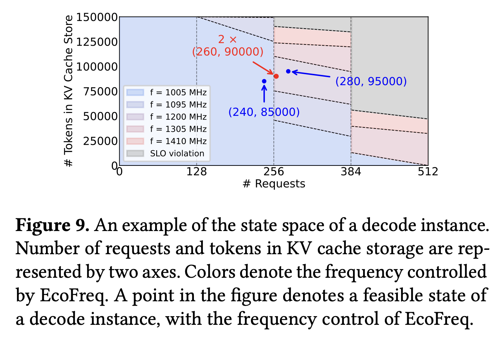

### 2\. EcoRoute: **State-space navigation router**

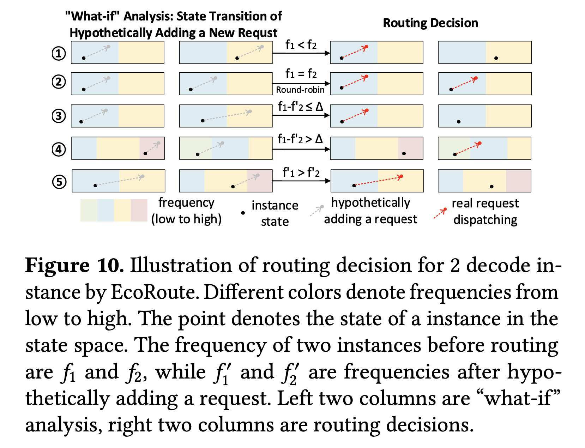

*   Instead of round-robin, EcoRoute runs “what-if” analyses in the **state space** of decode instances.
*   Routes asymmetrically to avoid batch-size boundaries, keeping one instance in low-frequency regime instead of both in higher frequency regimes.
*   Falls back gracefully to round-robin when boundaries aren’t in play.

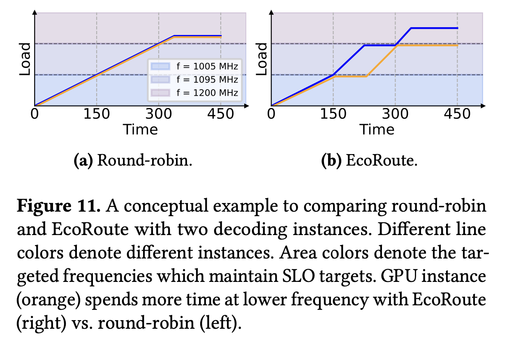

### 3\. EcoPred: **Load-aware latency predictor**

*   Simple linear regression model.
*   Prefill latency ~ batch token count.
*   Decode latency ~ requests + KV cache tokens.
*   Accuracy: ~7–14 ms MAE for TTFT, ~2–3 ms MAE for ITL.
*   Overhead: negligible (<0.1 ms).

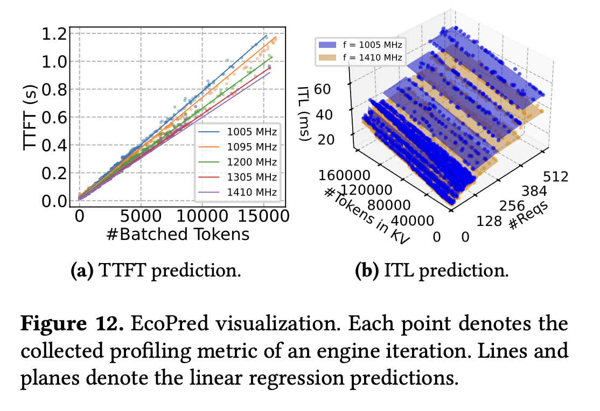

* * *

Evaluation highlights
---------------------

We implemented VoltanaLLM on **SGLang (v0.4.7)** and tested on **A100 GPUs** with three models (Ministral-3B, LLaMA-3.1-8B, Qwen3-32B) and two datasets (ShareGPT, LMSYS-Chat-1M).

**Main results (2 prefill, 2 decode instances):**

*   **Energy savings:** Up to **36.3%** vs. static max-frequency baseline.
*   **SLO attainment:** Comparable to always running at 1410 MHz (max-frequency).
*   **Workload robustness:** Benefits held across request rates, workloads, and SLO profiles.

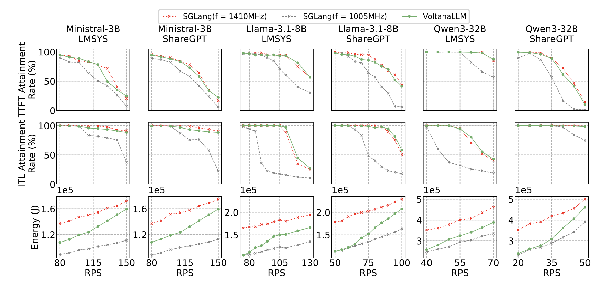

### Module-level breakdown

*   **EcoFreq only:** major energy savings by adaptive frequency scaling.
*   **EcoRoute added:** extra savings in decode by avoiding batch-size boundary inefficiencies.

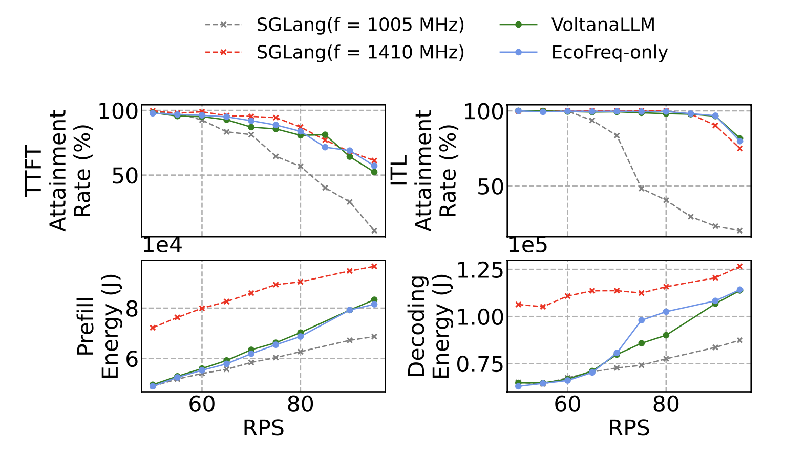

### Per-iteration responsiveness matters

Compared to window-based frequency control (e.g., 5s intervals in DynamoLLM):

*   **Window-based:** degrades SLOs, especially in prefill (batch sizes fluctuate rapidly).
*   **VoltanaLLM per-iteration:** adapts instantly, maintaining energy savings and latency targets.

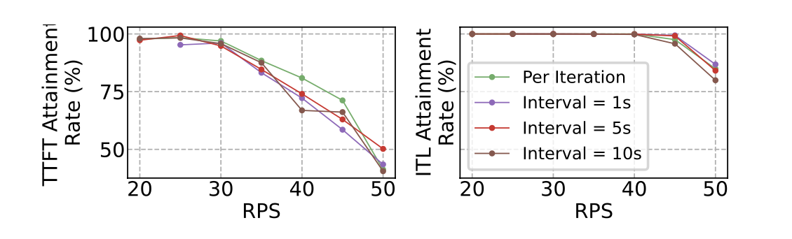

### Flexible SLO trade-offs

By tuning SLO thresholds:

*   **Tight SLOs:** VoltanaLLM behaves closer to max frequency.
*   **Relaxed SLOs:** Operates more at low frequency, increasing energy savings.

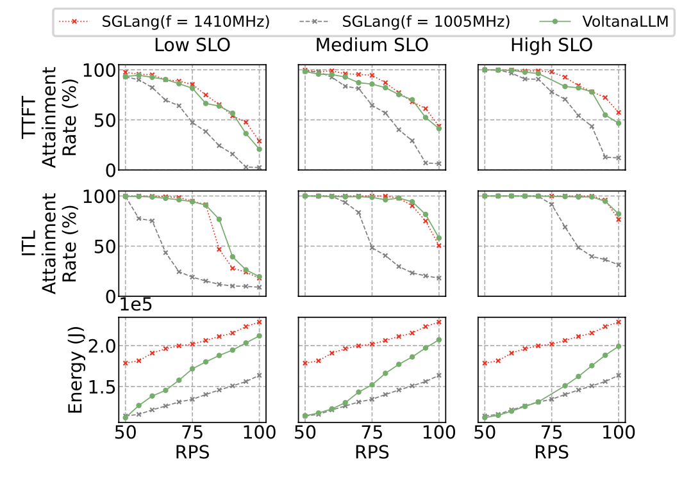

* * *

Practical lessons from building VoltanaLLM
------------------------------------------

1.  **Frequency switching overhead is real.** Calling **nvidia-smi** was too slow (~50 ms). Using **pyNVML** in a separate process brought it down to ~3 ms, enabling per-iteration responsiveness.
2.  **Prefill vs. decode control loops must be distinct.** Prefill TTFT includes both waiting and execution time; decode ITL does not. Mixing them breaks guarantees.
3.  **Batch boundaries dominate decode inefficiency.** EcoRoute’s boundary-aware routing avoided forcing _both_ instances into high frequency—an insight that wouldn’t emerge without fine-grained profiling.
4.  **Simple models beat complex ones.** Linear regression was fast, interpretable, and accurate enough. More complex ML models would have added overhead with little benefit.
5.  **Granularity tradeoffs matter.** More frequency levels gave slight energy improvements but slightly lower SLO attainment. Two levels (\[1005, 1410\] MHz) hit a good balance.

Closing thoughts
----------------

VoltanaLLM shows that **energy-efficient LLM serving isn’t just about hardware knobs**; it’s a systems problem. By combining **control theory insights**, **phase-specific frequency scaling**, and **routing-aware scheduling**, VoltanaLLM achieves double-digit energy savings without compromising user-facing performance.

As LLM deployment scales further, we believe these ideas—**fine-grained, feedback-driven, and phase-aware control**—will be critical for sustainable AI infrastructure.

* * *

[1] Radosvet Desislavov, Fernando Martínez-Plumed, José Hernández-Orallo, "Trends in AI inference energy consumption: Beyond the performance-vs-parameter laws of deep learning," Sustainable Computing: Informatics and Systems, Volume 38, 2023. <a href="https://doi.org/10.1016/j.suscom.2023.100857" target="_blank" rel="noopener">DOI: 10.1016/j.suscom.2023.100857</a> [↩](#ref1)

[2] Esha Choukse et al., "Power Stabilization for AI Training Datacenters," 2025. <a href="https://arxiv.org/abs/2508.14318" target="_blank" rel="noopener">arXiv:2508.14318</a> [↩](#ref2)

[3] Cooper Elsworth et al., "Measuring the environmental impact of delivering AI at Google Scale," 2025. <a href="https://arxiv.org/abs/2508.15734" target="_blank" rel="noopener">arXiv:2508.15734</a> [↩](#ref3)

* * *

