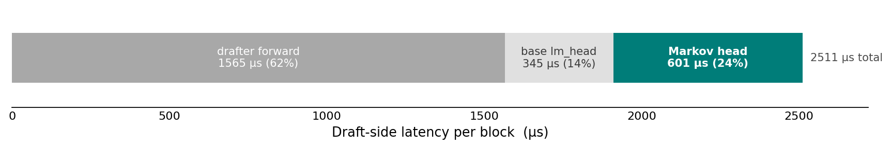

<style>
.xpress-grad{background:linear-gradient(0deg,#0043ce 0%,#1192e8 40%,#82cfff 72%,#f0fbff 100%);-webkit-background-clip:text;background-clip:text;color:transparent;font-style:italic;font-weight:700;font-family:Georgia,'Times New Roman',serif;letter-spacing:-.02em;}
</style>
<script>
(function(){
  function paint(){
    var hs=document.querySelectorAll('h1');
    for(var i=0;i<hs.length;i++){
      var h=hs[i];
      if(h.textContent.indexOf('XPress')===0&&h.innerHTML.indexOf('xpress-grad')<0){
        h.innerHTML=h.innerHTML.replace('XPress','<span class="xpress-grad">XPress</span>');
      }
    }
  }
  if(document.readyState==='loading'){document.addEventListener('DOMContentLoaded',paint);}else{paint();}
})();
</script>

<style>
.xpress-wrap{
  --bg:#ffffff; --surface:#f4f4f4; --surface2:#eaecef;
  --ink:#161616; --muted:#525252; --faint:#8d8d8d;
  --line:#e0e0e0; --line-strong:#c6c6c6;
  --accent:#0f62fe; --accent-strong:#0043ce; --accent-soft:#edf3ff;
  --teal:#007d79; --grey-bar:#a8a8a8;
  --serif:"Newsreader",Georgia,"Times New Roman",serif;
  --sans:"Inter",system-ui,-apple-system,"Segoe UI",Roboto,"Helvetica Neue",Arial,sans-serif;
  --mono:"SF Mono","Monaco","IBM Plex Mono","JetBrains Mono",ui-monospace,Menlo,Consolas,monospace;
  --col:58rem; --wide:82rem;
}
.xpress-wrap /* web-native Figure 3 */
.f3fig{max-width:56rem;}
.xpress-wrap .f3-wrap{display:grid;grid-template-columns:repeat(3,1fr);gap:.4rem;border:1px solid var(--line);border-radius:8px;padding:.8rem .6rem .4rem;background:#fff;}
.xpress-wrap .f3p{width:100%;height:auto;display:block;}
.xpress-wrap .f3t{font:600 13px var(--sans);fill:var(--ink);}
.xpress-wrap .f3ax{font:10px var(--sans);fill:var(--faint);}
.xpress-wrap .f3grid{stroke:#ececec;stroke-width:1;}
.xpress-wrap .f3xp{fill:none;stroke:var(--accent);stroke-width:2;}
.xpress-wrap .f3dot{fill:var(--accent);stroke:#fff;stroke-width:2;}
.xpress-wrap .f3mk{stroke:var(--teal);stroke-width:1.7;stroke-dasharray:5 4;fill:none;}
.xpress-wrap .f3-legend{display:flex;gap:1.6rem;justify-content:center;font:12.5px var(--sans);color:var(--ink);margin:0 0 .5rem;}
.xpress-wrap .f3-legend span{display:inline-flex;align-items:center;gap:.45rem;}
.xpress-wrap .f3-table{margin-top:.6rem;font:12px var(--sans);color:var(--faint);}
.xpress-wrap .f3-table table{border-collapse:collapse;margin-top:.4rem;}
.xpress-wrap .f3-table td, .xpress-wrap .f3-table th{border:1px solid var(--line);padding:.2rem .5rem;text-align:right;}
.xpress-wrap /* figures */
.archfig{max-width:62rem;}
.xpress-wrap .archfig svg{display:block;width:100%;height:auto;margin:0 auto;background:#fff;border:1px solid var(--line);border-radius:8px;padding:.6rem;}
.xpress-wrap #archtt{position:fixed;z-index:99;max-width:20rem;background:#161616;color:#f4f4f4;font-size:.82rem;line-height:1.35;padding:.5rem .65rem;border-radius:6px;pointer-events:none;opacity:0;transition:opacity .12s;box-shadow:0 4px 14px rgba(0,0,0,.25);}
.xpress-wrap .demo-video{margin:0 auto 1.4rem;}
.xpress-wrap .demo-video video{width:100%;border:1px solid var(--line);border-radius:10px;display:block;}
.xpress-wrap .demo-video figcaption{margin-top:.8rem;font-style:italic;}
.xpress-wrap .eqsys{display:grid;grid-template-columns:auto auto;gap:.5rem 1.1rem;align-items:baseline;
  width:fit-content;max-width:100%;margin:1.4rem auto;font-family:var(--serif);overflow-x:auto;justify-content:center;}
.xpress-wrap .eqsys .lbl{font-family:var(--sans);font-size:.8rem;color:var(--accent);white-space:nowrap;text-align:right;}
.xpress-wrap .eqsys .ex{font-size:1.04rem;}
.xpress-wrap /* refine demo */
.refine-demo{max-width:var(--col);margin:2rem auto;font-family:var(--sans);border:1px solid var(--line);
  border-radius:10px;padding:1.2rem 1.3rem;background:var(--surface);}
.xpress-wrap .rd-cap-top{font-size:.9rem;color:var(--muted);margin-bottom:1rem;}
.xpress-wrap .rd-cap-top b{color:var(--ink);}
.xpress-wrap .rd-anchor{color:var(--accent);font-weight:640;}
.xpress-wrap .rd-lane{margin:.9rem 0;}
.xpress-wrap .rd-head{display:flex;align-items:baseline;gap:.6rem;margin-bottom:.4rem;flex-wrap:wrap;}
.xpress-wrap .rd-name{font-weight:660;font-size:.98rem;}
.xpress-wrap .rd-sub{font-size:.8rem;color:var(--faint);}
.xpress-wrap .rd-stat{font-size:.8rem;color:var(--muted);margin-left:auto;}
.xpress-wrap .rd-stat b{color:var(--ink);}
.xpress-wrap .rd-stat .fin{color:var(--teal);font-weight:640;}
.xpress-wrap .rd-block{display:flex;flex-wrap:wrap;gap:4px;}
.xpress-wrap .rd-cell{font-family:var(--mono);font-size:.8rem;padding:.2rem .4rem;border-radius:4px;border:1px solid var(--line);
  background:var(--bg);color:var(--muted);min-width:1.4rem;text-align:center;transition:background .2s,color .2s,border-color .2s;}
.xpress-wrap .rd-cell.ok{background:var(--accent-soft);border-color:var(--accent);color:var(--accent-strong);}
.xpress-wrap .rd-cell.bad{background:#fff0f0;border-color:#da1e28;color:#a2191f;}
.xpress-wrap .rd-cell.idle, .xpress-wrap .rd-cell.neutral{opacity:.55;}
.xpress-wrap .rd-cell.just{box-shadow:0 0 0 2px var(--accent-soft);}
.xpress-wrap .rd-foot{display:flex;align-items:flex-start;gap:1rem;margin-top:1rem;}
.xpress-wrap .rd-note{font-size:.82rem;color:var(--muted);line-height:1.5;}
.xpress-wrap /* native bar charts */
.barfig{max-width:var(--col);margin:2.2rem auto;}
.xpress-wrap .barchart{border:1px solid var(--line);border-radius:8px;padding:1.2rem 1.3rem .7rem;}
.xpress-wrap .bc-legend{display:flex;gap:1.3rem;flex-wrap:wrap;font-family:var(--sans);font-size:.8rem;color:var(--muted);margin-bottom:1.3rem;}
.xpress-wrap .bc-k{display:inline-flex;align-items:center;gap:.4rem;}
.xpress-wrap .bc-sw{width:.8rem;height:.8rem;border-radius:2px;display:inline-block;}
.xpress-wrap .bc-groups{display:flex;gap:1.1rem;align-items:flex-end;overflow-x:auto;padding-bottom:.2rem;}
.xpress-wrap .bc-group{flex:1;min-width:66px;display:flex;flex-direction:column;align-items:center;gap:.45rem;}
.xpress-wrap .bc-bars{height:184px;display:flex;align-items:flex-end;gap:4px;width:100%;justify-content:center;}
.xpress-wrap .bc-bar{width:28%;position:relative;border-radius:3px 3px 0 0;min-height:2px;}
.xpress-wrap .bc-val{position:absolute;top:-1.1rem;left:50%;transform:translateX(-50%);font-family:var(--sans);font-size:.65rem;color:var(--muted);font-variant-numeric:tabular-nums;white-space:nowrap;}
.xpress-wrap .bc-lab{font-family:var(--sans);font-size:.71rem;line-height:1.1;color:var(--ink);text-align:center;word-break:break-word;}
.xpress-wrap /* hover a benchmark to select it; the rest fade back */
.bc-group{border-radius:6px;padding:.25rem .15rem;transition:opacity .18s ease, background .18s ease;}
.xpress-wrap .bc-groups:hover .bc-group{opacity:.28;}
.xpress-wrap .bc-groups .bc-group:hover{opacity:1;background:var(--accent-soft);}
.xpress-wrap .bc-bar{transition:box-shadow .18s ease;}
.xpress-wrap .bc-groups .bc-group:hover .bc-bar{box-shadow:0 2px 10px rgba(22,22,22,.20);}
.xpress-wrap .bc-groups .bc-group:hover .bc-val{color:var(--ink);font-weight:660;}
.xpress-wrap .bc-groups .bc-group:hover .bc-lab{font-weight:660;}
.xpress-wrap /* animated latency-vs-K chart */
.latfig{max-width:var(--col);margin:2.2rem auto;}
.xpress-wrap .lat-read{font-family:var(--sans);font-size:.88rem;color:var(--ink);background:var(--surface);border:1px solid var(--line);
  border-left:3px solid var(--accent);border-radius:8px;padding:.6rem .9rem;margin-bottom:1rem;line-height:1.45;}
.xpress-wrap .lat-read b{color:var(--accent);font-weight:660;}
.xpress-wrap .lat-chart{position:relative;height:214px;display:flex;align-items:flex-end;gap:8px;padding:0 .3rem;margin-top:1.5rem;border-bottom:1px solid var(--line-strong);}
.xpress-wrap /* vertical padding would make bar height% and line bottom% resolve against
     different boxes, .xpress-wrap floating the baseline above where the bars actually reach */
.lat-bar{flex:1;position:relative;height:0;background:var(--accent);border-radius:3px 3px 0 0;transition:height .5s cubic-bezier(.4,0,.2,1);}
.xpress-wrap .lat-val{position:absolute;top:-1.15rem;left:50%;transform:translateX(-50%);font-family:var(--sans);font-size:.64rem;
  color:var(--muted);font-variant-numeric:tabular-nums;white-space:nowrap;}
.xpress-wrap .lat-markov{position:absolute;left:0;right:0;border-top:2px dashed var(--teal);z-index:2;pointer-events:none;transform:translateY(2px);}
.xpress-wrap /* border-top draws ABOVE the bottom-anchored box; shift down by its own thickness so the line's top edge sits exactly at 601 us, .xpress-wrap just under the K=7 (603 us) bar top */
.lat-markov span{position:absolute;left:0;top:-1.05rem;font-family:var(--sans);font-size:.66rem;color:var(--teal);
  font-weight:640;background:var(--bg);padding:0 .35rem;}
.xpress-wrap .lat-klab{display:flex;gap:8px;padding:.35rem .3rem 0;}
.xpress-wrap .lat-klab span{flex:1;text-align:center;font-family:var(--sans);font-size:.72rem;color:var(--muted);font-variant-numeric:tabular-nums;}
.xpress-wrap .lat-xlab{font-family:var(--sans);font-size:.75rem;color:var(--faint);text-align:center;margin-top:.25rem;}
.xpress-wrap .latfig .replay{margin-top:1rem;}
@media(max-width:720px){.xpress-wrap .f3-wrap{grid-template-columns:repeat(2,1fr);}}
@media(max-width:480px){.xpress-wrap .f3-wrap{grid-template-columns:1fr;}}
</style>

<video src="img/case_study.mp4" autoplay muted loop playsinline controls preload="auto" style="width:100%"></video>

**Case study.** A real GSM8K prompt decoded three ways under the same timing setup: autoregressive, the dFlash drafter alone, and XPress (ours). Each pane advances by the tokens it accepts per target-verification step, so XPress finishes first. Once the dFlash drafter finishes, the autoregressive pane is fast-forwarded (&raquo;&raquo;) so you are not left watching it crawl.

**TL;DR.** Block-diffusion drafters like dFlash generate an entire block of draft tokens in a single forward pass, drastically reducing the overhead of multiple-token drafting in speculative decoding. The crucial final step of the single-pass discrete denoising process involves using the logit distribution at each position to sample conditionally independent tokens. The resulting draft is thus a set of per-position marginals, rather than a joint distribution: no draft token is guaranteed to depend on its predecessors. Such independently sampled marginals tend to produce sequences with tokens that are individually likely, but jointly improbable under the target model's distribution, which verifies each token conditionally. This can cause early rejection and limits acceptance length. To address this, we propose **XPress** as a means to restore the missing causality in diffusion drafters. XPress is a lightweight causal refiner that reconciles the whole diffusion block at once through parallel refinement, restoring and propagating causal dependencies across the draft without a token-by-token loop. On Qwen3-8B, across seven math, code, and chat benchmarks, XPress raises **acceptance length by ~30% on average (up to +56%)** and its **decoding throughput by ~1.3&times; on average (up to 1.7&times;)** compared to the dFlash diffusion drafter.

## 1. Diffusion drafters and the problem with parallel prediction

Speculative decoding (SD) [[Leviathan et al. 2023]](https://arxiv.org/abs/2211.17192) accelerates autoregressive generation by using a lightweight draft model to propose future tokens, which the larger target model verifies in one parallel forward pass. A single multi-token verification pass costs about the same as a standard single-token target-model decoding step in low concurrency scenarios, so every draft token that matches target model outputs is another token produced at no additional target cost. The speedup achieved by SD is mainly governed by two factors: the acceptance length <i>&tau;</i> (the number of drafted tokens the target accepts per verification step) and the cost of the drafting process itself, <i>T</i><sub>draft</sub>. A larger acceptance length amortizes each target verification pass over more generated tokens, while a cheaper drafter reduces the overhead paid to produce them. This forms a natural trade-off: we want to maximize the expected acceptance length of the drafter, while avoiding a proportional increase to drafting overhead.

Autoregressive (AR) generation has long been the default approach to drafting models, and the **EAGLE** series [[Li et al. 2024a]](https://arxiv.org/abs/2401.15077)[[2024b]](https://arxiv.org/abs/2406.16858)[[2025]](https://arxiv.org/abs/2503.01840) is one of the most representative AR-drafting SD methods. EAGLE's drafter is remarkably lightweight, as small as a single layer, yet it yields high-quality drafts. However, because drafting is autoregressive, generating *n* draft tokens involves *n* sequential forward passes of the draft model. As *n* becomes larger, the drafting overhead becomes increasingly pronounced, but acceptance length, which requires an unbroken chain of accepted verifications, does not. **dFlash** [[Chen et al. 2026]](https://arxiv.org/abs/2602.06036) resolves this via a block-diffusion model that proposes an entire block of draft tokens in a single forward pass. By turning *n* serial steps into a single parallel one, dFlash enables longer drafts (and downstream speedups for the target model) at near-constant overhead.

But the parallelism brought by the diffusion drafter carries an inherent limitation in accuracy. Unlike an AR drafter, where each position is conditioned on the preceding tokens, positions in a diffusion drafter are decoded from their marginal distributions. The token *k* is drawn without seeing what the token *k*&minus;1 turned out to be, so the block is a set of individually plausible tokens with no guarantee of causality. This can violate natural linguistic dependencies across positions, even when every token is locally high-probability. For example, a drafter predicting each position independently can put a plural verb after a singular subject and produce "she are", where each word is fine on its own but the verb contradicts the subject. At verification, these locally reasonable but jointly incoherent samples are rejected early by the left-to-right target model, limiting the achievable acceptance length.

One line of prior work tries to address this limitation by constructing a draft token tree. Tree-based drafting proposes a tree of candidate continuations and verifies the whole tree in a single target pass, so that the longest accepted path through the tree can be selected. Recent works, like **PRESTO** [[Wang et al. 2026]](https://arxiv.org/abs/2607.22634) and **DDTree** [[Ringel & Romano 2026]](https://arxiv.org/abs/2604.12989), have demonstrated that tree drafting can effectively enhance the achievable acceptance length of diffusion-drafter-based SD methods. Nevertheless, tree drafting has real limitations. Fundamentally, it hedges around the non-causality of the diffusion drafter by targeting recall rather than accuracy. On top of that, the required sparse, irregular tree attention is expensive and complex to serve. Moreover, because a candidate tree typically spans tens to hundreds of tokens, its gains fade quickly at large batch sizes, where the target pass is already compute-bound and those extra tokens are no longer free. The more direct fix is to see whether we can cheaply and effectively restore the lost causality for the diffusion drafter, which is the core research problem motivating XPress.

## 2. Causal refiner design in XPress

Rather than redesigning the diffusion drafter from scratch to restore causality, we instead ask if a small correction to existing outputs will suffice. What makes this plausible is a property already established for diffusion drafters: the correct token is frequently among the drafter's top-*k* candidates at each position [[Wang et al. 2026]](https://arxiv.org/abs/2607.22634). The drafter's block-level marginals already narrow each position to a small candidate set, it just lacks the causal information needed to identify the right token within that set. The problem of correction therefore reduces to picking the right token from a narrow preexisting set, which should be feasible for a lightweight causal refiner. We thus formulate the correction process as a causal refiner with four properties:

1. **Lightweight.** The refiner has little room for new parameters or architectural complexity, as the drafter's single parallel forward pass is already highly streamlined and performant, and this existing capability should be preserved.
2. **Causal.** Within that small resource budget, the refiner should inject real causal information, conditioning each token on its discretely sampled predecessors, rather than merely smoothing the drafter's marginals locally.
3. **Drafter-grounded.** The refiner should make good use of what the diffusion drafter already computes, like its hidden states, which typically carry rich information about the block compared to the pure token id [[S. L. Wang et al. 2026]](https://arxiv.org/abs/2605.09969).
4. **Low overhead.** Refinement cost at inference should stay a small fraction of the total drafting time, adding as little latency as possible. In particular, we must avoid reintroducing a fully serial, left-to-right pass.

We propose **XPress**, a lightweight causal refiner instantiating all four properties above. It is **lightweight**, adding only ~80M parameters (161 MB in bf16) on top of the diffusion drafter; it injects **causal** information, conditioning each token on its predecessors rather than smoothing marginals locally; it is **drafter-grounded**, reusing the diffusion drafter's hidden states rather than a bare token id; and it keeps **overhead low**, resolving the block in a few parallel iterations rather than a serial left-to-right pass.

<div class="xpress-wrap"><figure class="archfig"><svg id="archsvg" viewBox="0 128 1120 658" xmlns="http://www.w3.org/2000/svg" role="img"
     aria-label="XPress architecture: (a) diffusion drafter plus causal refiner, (b) the causal refiner internals">
  <defs>
    <marker id="ah" markerWidth="9" markerHeight="9" refX="6.5" refY="3.2" orient="auto">
      <path d="M0,0 L7,3.2 L0,6.4 z" fill="#222"/>
    </marker>
    <style>
      #archsvg .box{stroke-width:3;}
      #archsvg .lbl{font-size:16px;text-anchor:middle;dominant-baseline:middle;}
      #archsvg .lblS{font-size:14px;text-anchor:middle;dominant-baseline:middle;}
      #archsvg .anno{font-size:15px;fill:#1a1a1a;}
      #archsvg .title{font-size:18px;font-weight:700;text-anchor:middle;fill:#1a1a1a;}
      #archsvg .wire{stroke:#222;stroke-width:2.6;fill:none;}
      #archsvg .green{fill:#D9D9D9;stroke:#1a1a1a;}
      #archsvg .grey{fill:#ffffff;stroke:#1a1a1a;}
      #archsvg .purple{fill:#F1B6B0;stroke:#1a1a1a;}
      #archsvg .orange{fill:#DEEBF7;stroke:#1a1a1a;}
      #archsvg .yellow{fill:#BDD7EE;stroke:#1a1a1a;}
      #archsvg .red{fill:#CDE8CD;stroke:#1a1a1a;}
      #archsvg .blue{fill:#9DC3E6;stroke:#1a1a1a;}
      #archsvg .mod{cursor:help;}
      #archsvg .mod:hover .box{stroke-width:4.6;}
      #archsvg .mod:hover{filter:brightness(1.03);}
      #archsvg text{font-family:Arial,Helvetica,sans-serif;}
    </style>
  </defs>
  <!-- ==================== (a) Diffusion Drafter + Causal Refiner ==================== -->
  <g>
    <text class="anno" x="280" y="742" text-anchor="middle">Prefix KV Cache + Masked Tokens</text>
    <line class="wire" x1="280" y1="722" x2="280" y2="688" marker-end="url(#ah)"/>
    <g class="mod" data-tip="Bidirectional attention layer: one of the diffusion drafter&#8217;s transformer layers; denoises all block positions in parallel">
      <rect class="green box" x="170" y="640" width="220" height="46" rx="4"/><text class="lbl" x="280" y="663">Draft Layer 1</text>
    </g>
    <line class="wire" x1="280" y1="640" x2="280" y2="612" marker-end="url(#ah)"/>
    <g class="mod" data-tip="Bidirectional attention layer: one of the diffusion drafter&#8217;s transformer layers; denoises all block positions in parallel">
      <rect class="green box" x="170" y="566" width="220" height="46" rx="4"/><text class="lbl" x="280" y="589">Draft Layer 2</text>
    </g>
    <line class="wire" x1="280" y1="566" x2="280" y2="538" marker-end="url(#ah)"/>
    <g class="mod" data-tip="Bidirectional attention layer: one of the diffusion drafter&#8217;s transformer layers; denoises all block positions in parallel">
      <rect class="green box" x="170" y="492" width="220" height="46" rx="4"/><text class="lbl" x="280" y="515">Draft Layer 3</text>
    </g>
    <line class="wire" x1="280" y1="492" x2="280" y2="464" marker-end="url(#ah)"/>
    <g class="mod" data-tip="Bidirectional attention layer: one of the diffusion drafter&#8217;s transformer layers; denoises all block positions in parallel">
      <rect class="green box" x="170" y="418" width="220" height="46" rx="4"/><text class="lbl" x="280" y="441">Draft Layer 4</text>
    </g>
    <line class="wire" x1="280" y1="418" x2="280" y2="378" marker-end="url(#ah)"/>
    <text class="anno" x="200" y="413" text-anchor="middle">hidden states</text>
    <g class="mod" data-tip="Frozen target LM head: reads the drafter&#8217;s hidden states out to base logits over the vocabulary">
      <rect class="grey box" x="150" y="332" width="260" height="46" rx="4"/><text class="lbl" x="280" y="355">Target LM head</text>
    </g>
    <path class="wire" d="M280,400 H120 V300 H150" marker-end="url(#ah)"/>
    <line class="wire" x1="280" y1="332" x2="280" y2="304" marker-end="url(#ah)"/>
    <g class="mod" data-tip="Causal refiner (ours): lightweight head that restores causal dependencies across the block; detailed in (b)">
      <rect class="purple box" x="150" y="278" width="260" height="46" rx="4"/><text class="lbl" x="280" y="301">Causal Refiner</text>
    </g>
    <line class="wire" x1="280" y1="278" x2="280" y2="244" marker-end="url(#ah)"/>
    <g class="mod" data-tip="Element-wise add: the refiner&#8217;s logits bias is added to the base logits">
      <circle cx="280" cy="228" r="16" fill="#fff" stroke="#222" stroke-width="3"/>
      <line x1="280" y1="217" x2="280" y2="239" stroke="#222" stroke-width="3"/>
      <line x1="269" y1="228" x2="291" y2="228" stroke="#222" stroke-width="3"/>
    </g>
    <path class="wire" d="M410,355 H470 V228 H295" marker-end="url(#ah)"/>
    <text class="anno" x="385" y="214" text-anchor="middle">base logits</text>
    <line class="wire" x1="280" y1="213" x2="280" y2="186" marker-end="url(#ah)"/>
    <text class="anno" x="280" y="171" text-anchor="middle">final logits</text>
    <text class="title" x="280" y="772">(a) Diffusion Drafter + Causal Refiner</text>
  </g>
  <!-- ==================== (b) Causal Refiner ==================== -->
  <g>
    <text class="anno" x="740" y="732" text-anchor="middle">Token ID</text>
    <text class="anno" x="855" y="726" text-anchor="middle">Global</text>
    <text class="anno" x="855" y="744" text-anchor="middle">Hidden State</text>
    <text class="anno" x="972" y="726" text-anchor="middle">Per-Pos</text>
    <text class="anno" x="972" y="744" text-anchor="middle">Hidden State</text>
    <line class="wire" x1="740" y1="708" x2="740" y2="680" marker-end="url(#ah)"/>
    <line class="wire" x1="855" y1="708" x2="855" y2="680" marker-end="url(#ah)"/>
    <line class="wire" x1="972" y1="708" x2="972" y2="680" marker-end="url(#ah)"/>
    <g class="mod" data-tip="Input projection: embeds the previous-token id into r-space (V &#215; r)">
      <polygon class="orange box" points="716,636 764,636 778,678 702,678"/><text class="lblS" x="740" y="657">[V x r]</text>
    </g>
    <g class="mod" data-tip="Input projection: down-projects the block-global (mean-pooled) hidden state into r-space (H &#215; r)">
      <polygon class="orange box" points="831,636 879,636 893,678 817,678"/><text class="lblS" x="855" y="657">[h x r]</text>
    </g>
    <g class="mod" data-tip="Input projection: down-projects the per-position hidden state into r-space (H &#215; r)">
      <polygon class="orange box" points="948,636 996,636 1010,678 934,678"/><text class="lblS" x="972" y="657">[h x r]</text>
    </g>
    <path class="wire" d="M740,636 V612 H855"/>
    <path class="wire" d="M972,636 V612 H855"/>
    <line class="wire" x1="855" y1="636" x2="855" y2="612"/>
    <line class="wire" x1="855" y1="612" x2="855" y2="588" marker-end="url(#ah)"/>
    <g class="mod" data-tip="Fused input projection: concatenates the three r-space inputs and fuses them back to r (3r &#215; r)">
      <polygon class="yellow box" points="818,544 892,544 908,586 802,586"/><text class="lblS" x="855" y="567">[3r x r]</text>
    </g>
    <line class="wire" x1="855" y1="544" x2="855" y2="512" marker-end="url(#ah)"/>
    <g class="mod" data-tip="Causal linear mixer: lower-triangular per-channel mixing, so position k sees only its prefix j &#8804; k; this is where causality is injected">
      <rect class="purple box" x="812" y="430" width="86" height="82"/>
      <polygon points="812,430 812,512 894,512" fill="#C00000" opacity="0.30"/>
      <text class="lblS" x="855" y="472">[b x b x c]</text>
    </g>
    <line class="wire" x1="855" y1="430" x2="855" y2="404" marker-end="url(#ah)"/>
    <g class="mod" data-tip="Residual add: mixer output plus its input">
      <circle cx="855" cy="388" r="16" fill="#fff" stroke="#222" stroke-width="3"/>
      <line x1="855" y1="377" x2="855" y2="399" stroke="#222" stroke-width="3"/>
      <line x1="844" y1="388" x2="866" y2="388" stroke="#222" stroke-width="3"/>
    </g>
    <path class="wire" d="M855,528 H960 V388 H870" marker-end="url(#ah)"/>
    <line class="wire" x1="855" y1="373" x2="855" y2="352" marker-end="url(#ah)"/>
    <g class="mod" data-tip="MLP layer: per-position residual r &#8594; 2r &#8594; r block; cheap nonlinear expressiveness">
      <rect class="red box" x="800" y="306" width="110" height="46" rx="3"/><text class="lblS" x="855" y="329">[r x 2r x r]</text>
    </g>
    <line class="wire" x1="855" y1="306" x2="855" y2="284" marker-end="url(#ah)"/>
    <g class="mod" data-tip="Residual add: MLP output plus its input">
      <circle cx="855" cy="268" r="16" fill="#fff" stroke="#222" stroke-width="3"/>
      <line x1="855" y1="257" x2="855" y2="279" stroke="#222" stroke-width="3"/>
      <line x1="844" y1="268" x2="866" y2="268" stroke="#222" stroke-width="3"/>
    </g>
    <path class="wire" d="M855,373 H930 V268 H870" marker-end="url(#ah)"/>
    <line class="wire" x1="855" y1="253" x2="855" y2="232" marker-end="url(#ah)"/>
    <g class="mod" data-tip="Low-rank LM head: reads the r-space state back out to a vocabulary-sized logits bias (r &#215; V)">
      <polygon class="blue box" points="806,186 904,186 890,230 820,230"/><text class="lblS" x="855" y="209">[r x V]</text>
    </g>
    <line class="wire" x1="855" y1="186" x2="855" y2="160" marker-end="url(#ah)"/>
    <text class="anno" x="855" y="150" text-anchor="middle">logits bias</text>
    <text class="title" x="855" y="772">(b) XPress's Causal Refiner</text>
  </g>
</svg>
<figcaption><b>Figure 1.</b> (a) The full pipeline. The block-diffusion drafter produces hidden states, the target LM head reads out the base logits, and the refiner adds a learned logits bias to form the final logits. (b) Inside the refiner. The three inputs, the token id <i>W</i><sub>e</sub>[<i>x</i><sub>k&minus;1</sub>], the global hidden state <i>g</i>, and the per-position hidden state <i>h</i><sub>k</sub>, are down-projected into <i>r</i>-space, fused, mixed causally across block positions, passed through the <i>r</i>-space MLP, and read back out to vocabulary by the shared low-rank head. <i>Hover over a module to see what it is.</i></figcaption></figure>
<div id="archtt"></div>
<script>
(function(){
  var tt=document.getElementById('archtt');
  document.querySelectorAll('#archsvg .mod').forEach(function(g){
    g.addEventListener('mousemove',function(e){
      tt.textContent=g.getAttribute('data-tip');
      var x=Math.min(e.clientX+16, window.innerWidth-tt.offsetWidth-8);
      tt.style.left=x+'px'; tt.style.top=(e.clientY+18)+'px'; tt.style.opacity=1;
    });
    g.addEventListener('mouseleave',function(){ tt.style.opacity=0; });
  });
})();
</script></div>

Figure 1(a) shows the full pipeline of XPress: the diffusion drafter proposes the initial block in one pass, the target LM head reads out the base logits <i>s</i><sub>k</sub>, and the refiner adds a learned correction on top. Consistent with the aforementioned top-*k* observation, the refiner does not score the vocabulary from scratch. It adds a small per-position logit bias <i>&delta;</i><sub>k</sub> to the drafter's own logits, which re-ranks the handful of candidates the drafter already favours. The proposed causal refiner is shown in Figure 1(b). Let *V* denote the vocabulary size, *H* the drafter's hidden width, *B* the block length, and *r*=256 the low-rank dimension. All learned linear projections are named *W* with a descriptive subscript. The position-*k* logit bias is built in five steps:

<div style="text-align:center;margin:1.1em 0;font-size:1.05em"><div style="display:inline-block;text-align:left">(i)&nbsp;fuse: &nbsp;<i>a</i><sub>k</sub> = <i>W</i><sub>in</sub>[&thinsp;<i>h</i><sub>k</sub><i>W</i><sub>h</sub> &Vert; <i>g W</i><sub>g</sub> &Vert; <i>W</i><sub>e</sub>[<i>x</i><sub>k&minus;1</sub>]&thinsp;]<br>(ii)&nbsp;mix: &nbsp;<i>c</i><sub>k</sub> = <i>a</i><sub>k</sub> + &Sigma;<sub>j&le;k</sub> <i>L</i><sub>k,j</sub> &odot; <i>a</i><sub>j</sub><br>(iii)&nbsp;MLP: &nbsp;<i>z</i><sub>k</sub> = <i>c</i><sub>k</sub> + MLP(<i>c</i><sub>k</sub>)<br>(iv)&nbsp;readout: &nbsp;<i>&delta;</i><sub>k</sub> = <i>z</i><sub>k</sub> <i>W</i><sub>r</sub> &isin; &#8477;<sup>V</sup><br>(v)&nbsp;correct: &nbsp;<i>&ell;</i><sub>k</sub> = <i>s</i><sub>k</sub> + <i>&delta;</i><sub>k</sub></div></div>

The three inputs to the refiner are the drafter's per-position hidden state <i>h</i><sub>k</sub>, the previous-token id <i>x</i><sub>k&minus;1</sub>, and a block-global summary <i>g</i> = (1/<i>B</i>)&thinsp;&Sigma;<sub>j</sub> <i>h</i><sub>j</sub>, obtained by mean-pooling the drafter's hidden states over the block. On the output side, <i>s</i><sub>k</sub> is the drafter's own base logit vector for position *k*, <i>&delta;</i><sub>k</sub> is the learned correction, and <i>&ell;</i><sub>k</sub> is the corrected logit the block is re-decoded from. Among the learned maps, <i>W</i><sub>e</sub> &isin; &#8477;<sup>V&times;r</sup> is the token embedding, <i>W</i><sub>h</sub>, <i>W</i><sub>g</sub> &isin; &#8477;<sup>H&times;r</sup> the down-projections for <i>h</i><sub>k</sub> and *g*, <i>W</i><sub>in</sub> &isin; &#8477;<sup>3r&times;r</sup> the input fusion projection, and <i>W</i><sub>r</sub> &isin; &#8477;<sup>r&times;V</sup> the readout LM head. *L* is a per-channel lower-triangular mixer, so <i>L</i><sub>k,j</sub> is nonzero only for <i>j</i>&le;<i>k</i>. Each design choice earns back one of the four properties:

- **Lightweight.** Everything except the two vocabulary matrices <i>W</i><sub>e</sub>, <i>W</i><sub>r</sub> lives in *r*-space. <i>W</i><sub>e</sub> and <i>W</i><sub>r</sub> are the embedding and prediction head required by any logit-bias model. On top of them the refiner adds only small *r*-space components, so it stays a correction rather than overwriting the base drafter outputs.
- **Drafter-grounded.** Feeding the per-position hidden <i>h</i><sub>k</sub> and the block-global summary *g* into the correction gives it strictly more signal than a bare token id [[S. L. Wang et al. 2026]](https://arxiv.org/abs/2605.09969), and these are obtained for free from the drafter.
- **Causal.** Positions exchange information in *r*-space, via lower-triangular mixing so that position *k* sees its whole prefix <i>j</i>&le;<i>k</i>. Because the mix step (ii) happens after the prior sampled tokens are incorporated in the fuse step (i), this enables real causal conditioning. The mixer is also lighter than a conventional attention layer, since it is a single fixed triangular combination rather than a computed attention score, yet still expressive, encompassing the full set of learnable conv1d patterns.
- **Low overhead.** Mixing in *r*-space is lightweight, and a per-position <i>r</i>&rarr;2<i>r</i>&rarr;<i>r</i> residual MLP adds cheap nonlinear expressiveness. Steps (i) and (ii) stay linear, so the fuse-and-mix path folds into a single matrix at inference.

For a Qwen3-8B target and a dFlash drafter, XPress adds **80.5M** parameters, of which **96%** are the two vocabulary maps that any logit-bias head needs. The causal refiner itself, meaning the hidden inputs, the mixer, and the MLP, is only **2.8M (3.4%)**, and none of it scales with the 152k-token vocabulary. Relative to the 1.05B-parameter dFlash drafter it attaches to (5 transformer layers plus the input projection; the drafter reuses the target's embedding and LM head), the whole refiner is a **7.7%** add-on, and the causal core alone is **0.26%**.

| Module | Shape | Params |
|---|---|---|
| <i>W</i><sub>e</sub> &middot; embed | V &times; r | 38.9M |
| <i>W</i><sub>r</sub> &middot; readout | r &times; V | 38.9M |
| <i>W</i><sub>h</sub> + <i>W</i><sub>g</sub> | 2&middot;H &times; r | 2.10M |
| <i>W</i><sub>in</sub> | 3r &times; r | 0.20M |
| *L* &middot; causal mixer | r &times; B &times; B | 0.07M |
| MLP (SwiGLU) | r &rarr; 2r &rarr; r | 0.39M |
| **Total** | | **80.5M** |

## 3. Parallel refinement via Jacobi decoding

The causal mixer restricts the visibility of every position to its own prefix (<i>j</i>&le;<i>k</i>), so the refiner naturally supports autoregressive generation. However, this left-to-right generation process pays an additional *B*&minus;1-step loop cost over a block of *B* draft tokens. Instead of finalizing one position before moving to the next, XPress updates all positions at once and repeats this a few times, correcting any prior mistakes, an approach known as **Jacobi decoding** [[Song et al. 2021]](https://arxiv.org/abs/2002.03629). The block converges in far fewer than *B*&minus;1 iterations, which keeps the correction a small fraction of the draft step. Specifically, XPress seeds all positions from the diffusion drafter's one-shot predictions, then updates them jointly:

1. **Seed in parallel.** Take the latest set of discrete token predictions.
2. **Refine everything at once.** One forward of the refiner re-corrects all positions, accounting for any changes in prior positions that surfaced in the last step.
3. **Draw new tokens and repeat.** Tokens converge to the ground truth AR output from left to right, in at most *B*&minus;1 steps.

<div class="xpress-wrap"><figure class="refine-demo" id="refine-demo">
    <div class="rd-cap-top">A real 16-token draft block (<span class="rd-anchor">anchor: "We"</span> + 15 draft tokens) from a GSM8K step, refined by XPress's Jacobi iteration. The lane starts from the <b>one-shot block proposed by the diffusion drafter</b> and every iteration updates all positions at once. Blue = accepted (matches the target's greedy token), faded = still unsettled.</div>
    <div class="rd-lane">
      <div class="rd-head"><span class="rd-name" style="color:var(--accent)">XPress</span>
        <span class="rd-sub">Jacobi, updates all tokens each iteration</span><span class="rd-stat" id="xp-stat"></span></div>
      <div class="rd-block" id="xp-block"></div>
    </div>
    <div class="rd-foot">
      <span class="rd-note">The drafter's seed is already close, so many positions settle per iteration: the accepted prefix grows 9 &rarr; 10 &rarr; 12 &rarr; 14 &rarr; the full block in just a few parallel passes, where a sequential decode would need all 15 steps.</span>
    </div>
  </figure></div>

Formally, sequential greedy decoding computes <i>y</i><sub>k</sub> = argmax<sub>v</sub> <i>p</i><sub>k</sub>(v | <i>y</i><sub>&lt;k</sub>, <i>h</i>, <i>g</i>) in order, whereas Jacobi decoding solves the same equations from a seed <i>Y</i><sup>(0)</sup> by updating every position at once,

<div style="text-align:center;margin:1.1em 0;font-size:1.05em"><i>y</i><sub>k</sub><sup>(j+1)</sup> = argmax<sub>v</sub> <i>p</i><sub>k</sub>(v | <i>y</i><sup>(j)</sup><sub>&lt;k</sub>, <i>h</i>, <i>g</i>),&nbsp;&nbsp; <i>k</i> = 1,&hellip;,<i>B</i></div>

Each iteration updates every position from the block as it currently stands, and a position stops changing once the tokens before it have also halted. Because each position looks only leftward through the causal mixer, stability spreads rightward from the anchor token. The worst case is one position settling per iteration: given a stable substring of length *n*, the next prediction for position *n*+1 is guaranteed to also be stable in future iterations, as it depends only on the previous *n* tokens, plus the drafter features *h* and *g* which are precomputed constants. Thus *B*&minus;1 iterations is guaranteed to reproduce the exact sequential decode. In practice, though, this worst case is very rare. The drafter's seed is already a good guess, so on a typical iteration many positions settle at once, and *K* iterations lock in far more than *K* tokens. We find that *K*&approx;6 iterations is sufficient to yield acceptance length on par with a 15-step sequential decode.

## 4. Training XPress

The causal refiner is co-trained with the (co-adapted) drafter, using ground-truth token sequences and the predictions of the frozen target model. Both provide useful training signal, which we incorporate into two separate loss terms. The first is a teacher-forced cross-entropy against the ground truth token sequence. Conditioning each position on the ground-truth prefix <i>y</i><sub>&lt;k</sub>, it maximizes the probability of the correct token <i>x</i><sub>k</sub><sup>*</sup>. This is the standard next-token training objective that instills language capability into the refiner. But it optimizes the data likelihood, whereas what sets the speedup of SD is the acceptance rate against the target model. Under speculative sampling, the probability that a token drawn from vocabulary distribution *p* is accepted against the target model distribution <i>p</i><sup>t</sup> can be expressed as &Sigma;<sub>x</sub> min(<i>p</i>(x), <i>p</i><sup>t</sup>(x)) = 1 &minus; TV(<i>p</i>, <i>p</i><sup>t</sup>), with TV = &frac12;&Vert;<i>p</i> &minus; <i>p</i><sup>t</sup>&Vert;<sub>1</sub>. So

<div style="text-align:center;margin:1.1em 0;font-size:1.05em">&Vert;<i>p</i><sub>k</sub> &minus; <i>p</i><sub>k</sub><sup>t</sup>&Vert;<sub>1</sub> = 2&thinsp;TV = 2(1 &minus; accept rate<sub>k</sub>)</div>

and minimizing this total-variation distance to the target is exactly maximizing acceptance, so we make it the second loss term in our training objective. The two are complementary: the cross-entropy points the refiner at the right token, while the total-variation term shapes the distribution to the target the way acceptance is scored. The per-position loss is their weighted sum, with <i>w</i><sub>k</sub> = exp(&minus;(<i>k</i>&minus;1)/<i>&gamma;</i>) emphasizing earlier positions, since an inference-time verification mismatch disqualifies not just that position but all following positions in the draft:

<div style="text-align:center;margin:1.1em 0;font-size:1.05em">&#119923;(<i>p</i>) = &Sigma;<sub>k</sub> <i>w</i><sub>k</sub>&thinsp;[&thinsp;<i>&alpha;</i><sub>ce</sub>(&minus;log <i>p</i><sub>k</sub>(<i>x</i><sub>k</sub><sup>*</sup>)) + <i>&alpha;</i><sub>&ell;1</sub>&Vert;<i>p</i><sub>k</sub> &minus; <i>p</i><sub>k</sub><sup>t</sup>&Vert;<sub>1</sub>&thinsp;]</div>

During a forward pass, the drafter produces a base distribution <i>p</i><sup>b</sup>, which the refiner then uses to produce the refined distribution <i>p</i><sup>r</sup>. A naive application of our loss to <i>p</i><sup>r</sup> yields a performant refiner, and a drafter co-adapted to its behavior. Yet this can be problematic at inference time: the Jacobi iteration begins from the drafter's predictions, so if <i>p</i><sup>b</sup> drifts from the target <i>p</i><sup>t</sup>, the refiner is starting from a worse seed. We cannot differentiate through the token-sampling operation in the drafter that captures this dynamic, so we instead add an auxiliary loss on <i>p</i><sup>b</sup>, anchoring it to desired behavior.

An additional concern is the fact that minimizing the loss on <i>p</i><sup>r</sup> in a teacher-forced setting yields a refiner that is good at correcting gold prefixes, yet untested on the self-conditioned inputs it actually receives in the Jacobi decoding process. Therefore, we also introduce a *consistency* loss, in the spirit of consistency training for Jacobi decoding [[Kou et al. 2024]](https://arxiv.org/abs/2403.00835), to solve this misalignment between training and inference stages. Refiner forward passes are cheap by design, so during training we run a second forward pass whose token inputs come from the drafter's argmax(<i>p</i><sup>b</sup>), and apply our two-term loss to that output <i>p&#770;</i><sup>r</sup> as well.

The full objective thus applies &#119923; to three distributions:

<div style="text-align:center;margin:1.1em 0;font-size:1.05em">&#119923;<sub>total</sub> = &#119923;(<i>p</i><sup>r</sup>) + <i>&lambda;</i>&thinsp;&#119923;(<i>p</i><sup>b</sup>) + <i>&beta;</i>&thinsp;&#119923;(<i>p&#770;</i><sup>r</sup>)</div>

The first loss optimizes the refiner under teacher forcing, the second drafter-anchor loss preserves the quality of the diffusion drafter itself, and the final consistency loss allows the refiner to better operate under inference conditions.

## 5. Relation to concurrent works

Two concurrent works, **Domino** [[Huang et al. 2026]](https://arxiv.org/abs/2605.29707) and **DSpark** [[Cheng et al. 2026]](https://arxiv.org/abs/2607.05147), share our goal of restoring causality to a diffusion drafter, each by attaching a correction head that makes a position's logits depend on the tokens that came before. Both restore causal structure, but both pay for it in ways XPress does not: they decode the correction serially, and feed the refiner narrow inputs.

Domino uses a GRU to walk the diffusion block left to right, carrying a recurrent hidden state and emitting a per-position logit correction. Because position *k*'s correction depends on the realized prefix, causal structure is restored. But the GRU is a recurrence: it must step through the block one position at a time. DSpark aims to shed the overhead and complexity of Domino's left-to-right GRU by attaching an even lighter Markov head. For each position it adds a bias that depends only on the identity of the previous token,

<div style="text-align:center;margin:1.1em 0;font-size:1.05em"><i>&ell;</i><sub>k</sub> = lm_head(<i>h</i><sub>k</sub>) + <i>W</i><sub>2</sub>&thinsp;<i>W</i><sub>1</sub>[<i>x</i><sub>k&minus;1</sub>] &nbsp;&nbsp;<span style="opacity:.6;font-size:.85em">(drafter marginal + learned bigram bias)</span></div>

Here <i>W</i><sub>1</sub> &isin; &#8477;<sup>V&times;r</sup> embeds the previous token id and <i>W</i><sub>2</sub> &isin; &#8477;<sup>r&times;V</sup> reads the correction back out. This is exactly the degenerate corner of XPress's design space (&sect;2): keep only the token-id input, drop the causal mixer and the MLP, and the refiner collapses to the same bigram bias <i>&delta;</i><sub>k</sub> = <i>W</i><sub>e</sub>[<i>x</i><sub>k&minus;1</sub>]&thinsp;<i>W</i><sub>r</sub>.

The two heads differ in mechanism but share two weaknesses. The first is that both are serial. Domino's GRU passes its state from one position to the next, and DSpark's bias for token *k* is indexed by the sampled id of token *k*&minus;1. So either way a block of *B* tokens takes *B*&minus;1 steps that must run in order. (In SGLang's DSpark implementation the head is a plain Python for-loop [[sglang #30261]](https://github.com/sgl-project/sglang/pull/30261); CUDA-graph capture unrolls it and replays the kernels with negligible launch overhead, but the *B*&minus;1 steps still execute strictly one after another because each waits on the last.) The second weakness, most acute in DSpark, is narrow inputs. DSpark's Markov head conditions on a single previous token id, limiting it to repairing local two-token clashes, blind to both the rest of the block and the drafter's hidden states, precomputed representations that encode far more than any single token id. Domino's GRU state carries more than one token, but it still never sees the whole block at once. XPress, on the other hand, mixes over positions explicitly, and can even see into the future (in a limited fashion) despite its causal structure, by accessing the entire block's worth of drafter hidden states.

<div class="xpress-wrap"><figure class="refine-demo" id="refine-demo-cmp">
    <div class="rd-cap-top">The same 16-token draft block as in &sect;3, refined two ways. Both lanes start from the <b>same one-shot block proposed by the diffusion drafter</b>. Blue = accepted, red = a locked-in wrong token, faded = not settled yet.</div>
    <div class="rd-lane">
      <div class="rd-head"><span class="rd-name" style="color:var(--teal)">Markov head</span>
        <span class="rd-sub">sequential, locks one token per step</span><span class="rd-stat" id="mk-stat"></span></div>
      <div class="rd-block" id="mk-block"></div>
    </div>
    <div class="rd-lane">
      <div class="rd-head"><span class="rd-name" style="color:var(--accent)">XPress</span>
        <span class="rd-sub">Jacobi, updates all tokens each iteration</span><span class="rd-stat" id="xpc-stat"></span></div>
      <div class="rd-block" id="xpc-block"></div>
    </div>
    <div class="rd-foot">
      <span class="rd-note">Around position 10 the Markov head sees only the previous token and picks a locally plausible but wrong continuation, so it stalls at 9 accepted. XPress sees the whole block and settles the right token, then converges to the full block in a few parallel iterations.</span>
    </div>
  </figure></div>

## 6. Experiments

**Setup.** We use Qwen3-8B as the target model and dFlash as the base drafter. The block size for the diffusion drafter is 16, the sampling temperature is 0, and the maximum number of generated tokens is 2048. All heads compared share the same training recipe and the same harness at inference (CUDA graph and `torch.compile`), measured on H200. The results are for a single-sequence batch size.

**Acceptance length.** XPress raises acceptance length over the Markov head on all seven benchmarks, by **+3.0% to +7.0% (mean +5.0%)**, with the widest margins on code (LiveCodeBench +7.0%, HumanEval +5.0%). Read against the bare dFlash diffusion drafter, both heads do most of the work, but XPress captures more of it, **+29%** over the drafter's own <i>&tau;</i> on average versus +23% for the Markov head.

<div class="xpress-wrap"><figure class="barfig"><div class="barchart"><div class="bc-legend"><span class="bc-k"><span class="bc-sw" style="background:#a8a8a8"></span>dFlash drafter</span><span class="bc-k"><span class="bc-sw" style="background:#007d79"></span>Markov head</span><span class="bc-k"><span class="bc-sw" style="background:#0f62fe"></span>XPress (ours)</span></div><div class="bc-groups"><div class="bc-group"><div class="bc-bars"><div class="bc-bar" style="height:58.9%;background:#a8a8a8"><span class="bc-val">6.5</span></div><div class="bc-bar" style="height:87.9%;background:#007d79"><span class="bc-val">9.7</span></div><div class="bc-bar" style="height:91.9%;background:#0f62fe"><span class="bc-val">10.1</span></div></div><div class="bc-lab">GSM8K</div></div><div class="bc-group"><div class="bc-bars"><div class="bc-bar" style="height:70.1%;background:#a8a8a8"><span class="bc-val">7.7</span></div><div class="bc-bar" style="height:84.0%;background:#007d79"><span class="bc-val">9.2</span></div><div class="bc-bar" style="height:87.5%;background:#0f62fe"><span class="bc-val">9.6</span></div></div><div class="bc-lab">MATH500</div></div><div class="bc-group"><div class="bc-bars"><div class="bc-bar" style="height:58.5%;background:#a8a8a8"><span class="bc-val">6.4</span></div><div class="bc-bar" style="height:70.5%;background:#007d79"><span class="bc-val">7.8</span></div><div class="bc-bar" style="height:74.1%;background:#0f62fe"><span class="bc-val">8.2</span></div></div><div class="bc-lab">HumanEval</div></div><div class="bc-group"><div class="bc-bars"><div class="bc-bar" style="height:52.3%;background:#a8a8a8"><span class="bc-val">5.8</span></div><div class="bc-bar" style="height:62.7%;background:#007d79"><span class="bc-val">6.9</span></div><div class="bc-bar" style="height:64.6%;background:#0f62fe"><span class="bc-val">7.1</span></div></div><div class="bc-lab">MBPP</div></div><div class="bc-group"><div class="bc-bars"><div class="bc-bar" style="height:64.5%;background:#a8a8a8"><span class="bc-val">7.1</span></div><div class="bc-bar" style="height:72.3%;background:#007d79"><span class="bc-val">8.0</span></div><div class="bc-bar" style="height:75.9%;background:#0f62fe"><span class="bc-val">8.3</span></div></div><div class="bc-lab">AIME25</div></div><div class="bc-group"><div class="bc-bars"><div class="bc-bar" style="height:64.6%;background:#a8a8a8"><span class="bc-val">7.1</span></div><div class="bc-bar" style="height:71.4%;background:#007d79"><span class="bc-val">7.8</span></div><div class="bc-bar" style="height:76.4%;background:#0f62fe"><span class="bc-val">8.4</span></div></div><div class="bc-lab">LiveCodeBench</div></div><div class="bc-group"><div class="bc-bars"><div class="bc-bar" style="height:28.9%;background:#a8a8a8"><span class="bc-val">3.2</span></div><div class="bc-bar" style="height:37.5%;background:#007d79"><span class="bc-val">4.1</span></div><div class="bc-bar" style="height:39.8%;background:#0f62fe"><span class="bc-val">4.4</span></div></div><div class="bc-lab">MT-Bench</div></div></div></div><figcaption><b>Figure 2.</b> Per-step acceptance length &tau; across seven benchmarks. The dFlash drafter bar is the drafter alone with no refiner. &tau; is deterministic under greedy decoding.</figcaption></figure></div>

| Benchmark | dFlash drafter | Markov head | XPress (ours) | vs drafter | vs Markov |
|---|---|---|---|---|---|
| GSM8K | 6.48 | 9.67 | **10.11** | +56% | +4.6% |
| MATH500 | 7.71 | 9.24 | **9.62** | +25% | +4.1% |
| HumanEval | 6.44 | 7.76 | **8.15** | +27% | +5.0% |
| MBPP | 5.75 | 6.90 | **7.11** | +24% | +3.0% |
| AIME25 | 7.10 | 7.95 | **8.35** | +18% | +5.0% |
| LiveCodeBench | 7.11 | 7.85 | **8.40** | +18% | +7.0% |
| MT-Bench | 3.18 | 4.13 | **4.38** | +38% | +6.1% |
| **Mean** | | | | **+29%** | **+5.0%** |

**How many iterations are needed?** More Jacobi iterations lock in more of the prefix, but that is not the same as acceptance rising monotonically with *K*. When the accepted prefix already reaches past the settled region, one more iteration can overwrite a not-yet-converged tail token that happened to match the target, so <i>&tau;</i> can dip slightly. In practice <i>&tau;</i> rises quickly, crosses the Markov baseline within a few iterations, and plateaus by *K*&approx;7; pushing to *K*=16 never beats the plateau, so a small *K* captures essentially all of the gain.

<div class="xpress-wrap"><figure class="latfig" id="lat-fig">
  <div class="lat-read" id="lat-read">Refiner latency as the number of Jacobi iterations grows.</div>
  <div class="lat-chart">
    <div class="lat-markov" style="bottom:83.5%"><span>Markov head · 601 µs</span></div>
    <div class="lat-bar" data-h="20.83"><span class="lat-val">150</span></div><div class="lat-bar" data-h="31.53"><span class="lat-val">227</span></div><div class="lat-bar" data-h="41.81"><span class="lat-val">301</span></div><div class="lat-bar" data-h="52.64"><span class="lat-val">379</span></div><div class="lat-bar" data-h="62.78"><span class="lat-val">452</span></div><div class="lat-bar" data-h="73.61"><span class="lat-val">530</span></div><div class="lat-bar" data-h="83.75"><span class="lat-val">603</span></div><div class="lat-bar" data-h="94.58"><span class="lat-val">681</span></div>
  </div>
  <div class="lat-klab"><span>1</span><span>2</span><span>3</span><span>4</span><span>5</span><span>6</span><span>7</span><span>8</span></div>
  <div class="lat-xlab">Jacobi iterations K</div>
  <figcaption><b>Figure 3.</b> Measured refiner latency per block versus the number of Jacobi iterations <i>K</i>. Each XPress iteration adds about 75 µs, so latency is linear in <i>K</i> and independent of block size, whereas the Markov head pays a fixed 15-step serial cost (dashed line).</figcaption>
</figure><script>(function(){var bars=[].slice.call(document.querySelectorAll("#lat-fig .lat-bar"));var read=document.getElementById("lat-read");var LAT=[150,227,301,379,452,530,603,681],MK=601;var reduce=matchMedia&&matchMedia("(prefers-reduced-motion: reduce)").matches;function line(k){var v=LAT[k-1];var s=v<=MK?((MK/v).toFixed(2)+"\u00d7 faster than the Markov head"):"past the 601 \u00b5s crossover";return "K = "+k+"  \u00b7  XPress "+v+" \u00b5s  \u00b7  "+s;}var timer=null;function play(){if(timer)clearInterval(timer);if(reduce){bars.forEach(function(b){b.style.height=b.dataset.h+"%";});read.innerHTML=line(8);return;}bars.forEach(function(b){b.style.height="0%";});var i=0;timer=setInterval(function(){bars[i].style.height=bars[i].dataset.h+"%";read.innerHTML=line(i+1);i++;if(i>=bars.length){clearInterval(timer);setTimeout(function(){read.innerHTML="By <b>K=4</b> XPress already beats the Markov head on accuracy, at <b>379 \u00b5s</b>, about <b>1.6\u00d7 faster</b>. It stays cheaper through K=6 and crosses over near K=7.";},700);setTimeout(play,4200);}},560);}play();})();</script></div>

**Drafting-time latency.** As shown in Figure 3, XPress's cost grows with the number of Jacobi iterations: each Jacobi iteration adds about 75 &micro;s, so the refiner runs from **150 &micro;s** at *K*=1 to **681 &micro;s** at *K*=8. The Markov head is a fixed **601 &micro;s**, its 15-step serial decode regardless of *K*, so the two cross near *K*=7. As shown in Figure 4, XPress never needs to run that far. It matches or beats the Markov head's per-step acceptance on every benchmark by *K*=4, and at *K*=4 the refiner costs just **379 &micro;s**, a **1.6&times; speedup** over the Markov head. In other words, at the first point where XPress is already more accurate, it is also markedly faster. Pushing on to the accuracy plateau at *K*=6 still leaves it cheaper (530 &micro;s, a 1.13&times; speedup).

<div class="xpress-wrap"><figure class="f3fig"><div class="f3-legend"><span><svg width="26" height="10"><line x1="0" y1="5" x2="26" y2="5" class="f3xp"/><circle cx="13" cy="5" r="3.2" class="f3dot"/></svg> XPress (ours)</span><span><svg width="26" height="10"><line x1="0" y1="5" x2="26" y2="5" class="f3mk"/></svg> Markov head</span></div><div class="f3-wrap"><svg viewBox="0 0 340 218" class="f3p" data-name="GSM8K"><text x="38" y="16" class="f3t">GSM8K</text><line x1="38" y1="145.5" x2="328" y2="145.5" class="f3grid"/><text x="33" y="149.0" class="f3ax" text-anchor="end">9.5</text><line x1="38" y1="86.0" x2="328" y2="86.0" class="f3grid"/><text x="33" y="89.5" class="f3ax" text-anchor="end">10</text><text x="38.0" y="210" class="f3ax" text-anchor="middle">1</text><text x="96.0" y="210" class="f3ax" text-anchor="middle">4</text><text x="173.3" y="210" class="f3ax" text-anchor="middle">8</text><text x="250.7" y="210" class="f3ax" text-anchor="middle">12</text><text x="328.0" y="210" class="f3ax" text-anchor="middle">16</text><line x1="38" y1="125.3" x2="328" y2="125.3" class="f3mk"/><polyline points="38.0,170.6 57.3,134.8 76.7,122.9 96.0,89.6 115.3,82.4 134.7,69.3 154.0,70.5 173.3,61.0 212.0,56.2 250.7,52.6 289.3,51.4 328.0,51.4" class="f3xp"/><circle cx="38.0" cy="170.6" r="3.2" class="f3dot"/><circle cx="57.3" cy="134.8" r="3.2" class="f3dot"/><circle cx="76.7" cy="122.9" r="3.2" class="f3dot"/><circle cx="96.0" cy="89.6" r="3.2" class="f3dot"/><circle cx="115.3" cy="82.4" r="3.2" class="f3dot"/><circle cx="134.7" cy="69.3" r="3.2" class="f3dot"/><circle cx="154.0" cy="70.5" r="3.2" class="f3dot"/><circle cx="173.3" cy="61.0" r="3.2" class="f3dot"/><circle cx="212.0" cy="56.2" r="3.2" class="f3dot"/><circle cx="250.7" cy="52.6" r="3.2" class="f3dot"/><circle cx="289.3" cy="51.4" r="3.2" class="f3dot"/><circle cx="328.0" cy="51.4" r="3.2" class="f3dot"/></svg><svg viewBox="0 0 340 218" class="f3p" data-name="MATH500"><text x="38" y="16" class="f3t">MATH500</text><line x1="38" y1="173.1" x2="328" y2="173.1" class="f3grid"/><text x="33" y="176.6" class="f3ax" text-anchor="end">8.8</text><line x1="38" y1="121.4" x2="328" y2="121.4" class="f3grid"/><text x="33" y="124.9" class="f3ax" text-anchor="end">9.2</text><line x1="38" y1="69.6" x2="328" y2="69.6" class="f3grid"/><text x="33" y="73.1" class="f3ax" text-anchor="end">9.6</text><text x="38.0" y="210" class="f3ax" text-anchor="middle">1</text><text x="96.0" y="210" class="f3ax" text-anchor="middle">4</text><text x="173.3" y="210" class="f3ax" text-anchor="middle">8</text><text x="250.7" y="210" class="f3ax" text-anchor="middle">12</text><text x="328.0" y="210" class="f3ax" text-anchor="middle">16</text><line x1="38" y1="116.2" x2="328" y2="116.2" class="f3mk"/><polyline points="38.0,170.6 57.3,131.7 76.7,112.3 96.0,72.2 115.3,67.0 134.7,72.2 154.0,51.4 173.3,56.6 212.0,59.2 250.7,60.5 289.3,60.5 328.0,60.5" class="f3xp"/><circle cx="38.0" cy="170.6" r="3.2" class="f3dot"/><circle cx="57.3" cy="131.7" r="3.2" class="f3dot"/><circle cx="76.7" cy="112.3" r="3.2" class="f3dot"/><circle cx="96.0" cy="72.2" r="3.2" class="f3dot"/><circle cx="115.3" cy="67.0" r="3.2" class="f3dot"/><circle cx="134.7" cy="72.2" r="3.2" class="f3dot"/><circle cx="154.0" cy="51.4" r="3.2" class="f3dot"/><circle cx="173.3" cy="56.6" r="3.2" class="f3dot"/><circle cx="212.0" cy="59.2" r="3.2" class="f3dot"/><circle cx="250.7" cy="60.5" r="3.2" class="f3dot"/><circle cx="289.3" cy="60.5" r="3.2" class="f3dot"/><circle cx="328.0" cy="60.5" r="3.2" class="f3dot"/></svg><svg viewBox="0 0 340 218" class="f3p" data-name="HumanEval"><text x="38" y="16" class="f3t">HumanEval</text><line x1="38" y1="137.1" x2="328" y2="137.1" class="f3grid"/><text x="33" y="140.6" class="f3ax" text-anchor="end">7.6</text><line x1="38" y1="79.0" x2="328" y2="79.0" class="f3grid"/><text x="33" y="82.5" class="f3ax" text-anchor="end">8</text><text x="38.0" y="210" class="f3ax" text-anchor="middle">1</text><text x="96.0" y="210" class="f3ax" text-anchor="middle">4</text><text x="173.3" y="210" class="f3ax" text-anchor="middle">8</text><text x="250.7" y="210" class="f3ax" text-anchor="middle">12</text><text x="328.0" y="210" class="f3ax" text-anchor="middle">16</text><line x1="38" y1="113.9" x2="328" y2="113.9" class="f3mk"/><polyline points="38.0,170.6 57.3,119.7 76.7,92.1 96.0,89.2 115.3,71.8 134.7,57.3 154.0,61.6 173.3,51.4 212.0,51.4 250.7,51.4 289.3,51.4 328.0,51.4" class="f3xp"/><circle cx="38.0" cy="170.6" r="3.2" class="f3dot"/><circle cx="57.3" cy="119.7" r="3.2" class="f3dot"/><circle cx="76.7" cy="92.1" r="3.2" class="f3dot"/><circle cx="96.0" cy="89.2" r="3.2" class="f3dot"/><circle cx="115.3" cy="71.8" r="3.2" class="f3dot"/><circle cx="134.7" cy="57.3" r="3.2" class="f3dot"/><circle cx="154.0" cy="61.6" r="3.2" class="f3dot"/><circle cx="173.3" cy="51.4" r="3.2" class="f3dot"/><circle cx="212.0" cy="51.4" r="3.2" class="f3dot"/><circle cx="250.7" cy="51.4" r="3.2" class="f3dot"/><circle cx="289.3" cy="51.4" r="3.2" class="f3dot"/><circle cx="328.0" cy="51.4" r="3.2" class="f3dot"/></svg><svg viewBox="0 0 340 218" class="f3p" data-name="MBPP"><text x="38" y="16" class="f3t">MBPP</text><line x1="38" y1="144.7" x2="328" y2="144.7" class="f3grid"/><text x="33" y="148.2" class="f3ax" text-anchor="end">6.6</text><line x1="38" y1="92.9" x2="328" y2="92.9" class="f3grid"/><text x="33" y="96.4" class="f3ax" text-anchor="end">6.9</text><line x1="38" y1="41.1" x2="328" y2="41.1" class="f3grid"/><text x="33" y="44.6" class="f3ax" text-anchor="end">7.2</text><text x="38.0" y="210" class="f3ax" text-anchor="middle">1</text><text x="96.0" y="210" class="f3ax" text-anchor="middle">4</text><text x="173.3" y="210" class="f3ax" text-anchor="middle">8</text><text x="250.7" y="210" class="f3ax" text-anchor="middle">12</text><text x="328.0" y="210" class="f3ax" text-anchor="middle">16</text><line x1="38" y1="86.0" x2="328" y2="86.0" class="f3mk"/><polyline points="38.0,170.6 57.3,129.1 76.7,103.2 96.0,75.6 115.3,70.4 134.7,63.5 154.0,56.6 173.3,58.3 212.0,51.4 250.7,51.4 289.3,51.4 328.0,51.4" class="f3xp"/><circle cx="38.0" cy="170.6" r="3.2" class="f3dot"/><circle cx="57.3" cy="129.1" r="3.2" class="f3dot"/><circle cx="76.7" cy="103.2" r="3.2" class="f3dot"/><circle cx="96.0" cy="75.6" r="3.2" class="f3dot"/><circle cx="115.3" cy="70.4" r="3.2" class="f3dot"/><circle cx="134.7" cy="63.5" r="3.2" class="f3dot"/><circle cx="154.0" cy="56.6" r="3.2" class="f3dot"/><circle cx="173.3" cy="58.3" r="3.2" class="f3dot"/><circle cx="212.0" cy="51.4" r="3.2" class="f3dot"/><circle cx="250.7" cy="51.4" r="3.2" class="f3dot"/><circle cx="289.3" cy="51.4" r="3.2" class="f3dot"/><circle cx="328.0" cy="51.4" r="3.2" class="f3dot"/></svg><svg viewBox="0 0 340 218" class="f3p" data-name="LiveCodeBench"><text x="38" y="16" class="f3t">LiveCodeBench</text><line x1="38" y1="162.1" x2="328" y2="162.1" class="f3grid"/><text x="33" y="165.6" class="f3ax" text-anchor="end">7.6</text><line x1="38" y1="105.3" x2="328" y2="105.3" class="f3grid"/><text x="33" y="108.8" class="f3ax" text-anchor="end">8</text><line x1="38" y1="48.6" x2="328" y2="48.6" class="f3grid"/><text x="33" y="52.1" class="f3ax" text-anchor="end">8.4</text><text x="38.0" y="210" class="f3ax" text-anchor="middle">1</text><text x="96.0" y="210" class="f3ax" text-anchor="middle">4</text><text x="173.3" y="210" class="f3ax" text-anchor="middle">8</text><text x="250.7" y="210" class="f3ax" text-anchor="middle">12</text><text x="328.0" y="210" class="f3ax" text-anchor="middle">16</text><line x1="38" y1="126.6" x2="328" y2="126.6" class="f3mk"/><polyline points="38.0,157.8 57.3,170.6 76.7,85.5 96.0,51.4 115.3,91.1 134.7,64.2 154.0,116.7 173.3,98.2 212.0,74.1 250.7,102.5 289.3,79.8 328.0,79.8" class="f3xp"/><circle cx="38.0" cy="157.8" r="3.2" class="f3dot"/><circle cx="57.3" cy="170.6" r="3.2" class="f3dot"/><circle cx="76.7" cy="85.5" r="3.2" class="f3dot"/><circle cx="96.0" cy="51.4" r="3.2" class="f3dot"/><circle cx="115.3" cy="91.1" r="3.2" class="f3dot"/><circle cx="134.7" cy="64.2" r="3.2" class="f3dot"/><circle cx="154.0" cy="116.7" r="3.2" class="f3dot"/><circle cx="173.3" cy="98.2" r="3.2" class="f3dot"/><circle cx="212.0" cy="74.1" r="3.2" class="f3dot"/><circle cx="250.7" cy="102.5" r="3.2" class="f3dot"/><circle cx="289.3" cy="79.8" r="3.2" class="f3dot"/><circle cx="328.0" cy="79.8" r="3.2" class="f3dot"/></svg><svg viewBox="0 0 340 218" class="f3p" data-name="MT-Bench"><text x="38" y="16" class="f3t">MT-Bench</text><line x1="38" y1="177.8" x2="328" y2="177.8" class="f3grid"/><text x="33" y="181.3" class="f3ax" text-anchor="end">4</text><line x1="38" y1="141.7" x2="328" y2="141.7" class="f3grid"/><text x="33" y="145.2" class="f3ax" text-anchor="end">4.1</text><line x1="38" y1="105.6" x2="328" y2="105.6" class="f3grid"/><text x="33" y="109.1" class="f3ax" text-anchor="end">4.2</text><line x1="38" y1="69.5" x2="328" y2="69.5" class="f3grid"/><text x="33" y="73.0" class="f3ax" text-anchor="end">4.3</text><line x1="38" y1="33.4" x2="328" y2="33.4" class="f3grid"/><text x="33" y="36.9" class="f3ax" text-anchor="end">4.4</text><text x="38.0" y="210" class="f3ax" text-anchor="middle">1</text><text x="96.0" y="210" class="f3ax" text-anchor="middle">4</text><text x="173.3" y="210" class="f3ax" text-anchor="middle">8</text><text x="250.7" y="210" class="f3ax" text-anchor="middle">12</text><text x="328.0" y="210" class="f3ax" text-anchor="middle">16</text><line x1="38" y1="130.9" x2="328" y2="130.9" class="f3mk"/><polyline points="38.0,170.6 57.3,130.9 76.7,109.2 96.0,80.3 115.3,69.5 134.7,62.3 154.0,55.1 173.3,55.1 212.0,51.4 250.7,51.4 289.3,51.4 328.0,51.4" class="f3xp"/><circle cx="38.0" cy="170.6" r="3.2" class="f3dot"/><circle cx="57.3" cy="130.9" r="3.2" class="f3dot"/><circle cx="76.7" cy="109.2" r="3.2" class="f3dot"/><circle cx="96.0" cy="80.3" r="3.2" class="f3dot"/><circle cx="115.3" cy="69.5" r="3.2" class="f3dot"/><circle cx="134.7" cy="62.3" r="3.2" class="f3dot"/><circle cx="154.0" cy="55.1" r="3.2" class="f3dot"/><circle cx="173.3" cy="55.1" r="3.2" class="f3dot"/><circle cx="212.0" cy="51.4" r="3.2" class="f3dot"/><circle cx="250.7" cy="51.4" r="3.2" class="f3dot"/><circle cx="289.3" cy="51.4" r="3.2" class="f3dot"/><circle cx="328.0" cy="51.4" r="3.2" class="f3dot"/></svg></div><figcaption><b>Figure 4.</b> Per-step <i>&tau;</i> versus the number of Jacobi iterations <i>K</i>, from <i>K</i>=1 to 16, with the Markov head as a horizontal baseline (dashed). <i>&tau;</i> climbs past the baseline within a few iterations, then flattens; the small non-monotone wiggles past the plateau are dataset-dependent (e.g. LiveCodeBench).</figcaption></figure></div>



**Figure 5.** Composition of the draft-side latency per block for the Markov head (gsm8k, block 16, H200/sdpa). The drafter forward and the base `lm_head` are shared across heads; the refiner is the CUDA-graphed 15-step serial decode, about a quarter of the draft cost.

Figure 5 breaks the draft step into its three parts: the drafter's forward pass, the base `lm_head` readout, and the causal refiner. The first two are shared by every head; the only difference is the refiner. But that refiner cost is non-trivial: even run as a compiled unrolled loop, the Markov head's 15-step serial decode is about **24% of the draft-side cost**. XPress acts to minimize this slice, replacing the 15-step serial decode with a handful of Jacobi iterations.

**End-to-end throughput.** As shown in Figure 6, XPress reaches up to **8.2&times; over autoregressive decoding** (GSM8K) and averages **6.2&times;**, versus 5.9&times; for the Markov head and 4.9&times; for the bare drafter. Against the Markov head, though, the margin is only **+5%**, well short of the drafting-time speedup above. The reason is that each decode step is dominated by the target's verification pass. The drafting-time speedup would carry through more fully in settings where the draft is a larger share of each step, for example larger blocks or a cheaper, quantized target, where we would expect the latency advantage to surface end to end.

<div class="xpress-wrap"><figure class="barfig"><div class="barchart"><div class="bc-legend"><span class="bc-k"><span class="bc-sw" style="background:#a8a8a8"></span>dFlash drafter</span><span class="bc-k"><span class="bc-sw" style="background:#007d79"></span>Markov head</span><span class="bc-k"><span class="bc-sw" style="background:#0f62fe"></span>XPress (ours)</span></div><div class="bc-groups"><div class="bc-group"><div class="bc-bars"><div class="bc-bar" style="height:53.3%;background:#a8a8a8"><span class="bc-val">4.8×</span></div><div class="bc-bar" style="height:86.7%;background:#007d79"><span class="bc-val">7.8×</span></div><div class="bc-bar" style="height:91.1%;background:#0f62fe"><span class="bc-val">8.2×</span></div></div><div class="bc-lab">GSM8K</div></div><div class="bc-group"><div class="bc-bars"><div class="bc-bar" style="height:75.6%;background:#a8a8a8"><span class="bc-val">6.8×</span></div><div class="bc-bar" style="height:80.0%;background:#007d79"><span class="bc-val">7.2×</span></div><div class="bc-bar" style="height:83.3%;background:#0f62fe"><span class="bc-val">7.5×</span></div></div><div class="bc-lab">MATH500</div></div><div class="bc-group"><div class="bc-bars"><div class="bc-bar" style="height:55.6%;background:#a8a8a8"><span class="bc-val">5.0×</span></div><div class="bc-bar" style="height:70.0%;background:#007d79"><span class="bc-val">6.3×</span></div><div class="bc-bar" style="height:73.3%;background:#0f62fe"><span class="bc-val">6.6×</span></div></div><div class="bc-lab">HumanEval</div></div><div class="bc-group"><div class="bc-bars"><div class="bc-bar" style="height:52.2%;background:#a8a8a8"><span class="bc-val">4.7×</span></div><div class="bc-bar" style="height:63.3%;background:#007d79"><span class="bc-val">5.7×</span></div><div class="bc-bar" style="height:65.6%;background:#0f62fe"><span class="bc-val">5.9×</span></div></div><div class="bc-lab">MBPP</div></div><div class="bc-group"><div class="bc-bars"><div class="bc-bar" style="height:56.7%;background:#a8a8a8"><span class="bc-val">5.1×</span></div><div class="bc-bar" style="height:61.1%;background:#007d79"><span class="bc-val">5.5×</span></div><div class="bc-bar" style="height:64.4%;background:#0f62fe"><span class="bc-val">5.8×</span></div></div><div class="bc-lab">AIME25</div></div><div class="bc-group"><div class="bc-bars"><div class="bc-bar" style="height:57.8%;background:#a8a8a8"><span class="bc-val">5.2×</span></div><div class="bc-bar" style="height:63.3%;background:#007d79"><span class="bc-val">5.7×</span></div><div class="bc-bar" style="height:67.8%;background:#0f62fe"><span class="bc-val">6.1×</span></div></div><div class="bc-lab">LiveCodeBench</div></div><div class="bc-group"><div class="bc-bars"><div class="bc-bar" style="height:28.9%;background:#a8a8a8"><span class="bc-val">2.6×</span></div><div class="bc-bar" style="height:36.7%;background:#007d79"><span class="bc-val">3.3×</span></div><div class="bc-bar" style="height:38.9%;background:#0f62fe"><span class="bc-val">3.5×</span></div></div><div class="bc-lab">MT-Bench</div></div></div></div><figcaption><b>Figure 6.</b> End-to-end throughput speedup over autoregressive decoding (total tokens over total wall time), for the dFlash drafter alone, the Markov head, and XPress, across seven benchmarks. Each throughput is averaged over 5 runs to reduce run-to-run noise. AR baseline &approx; 110 tok/s. Drafter, Markov, and XPress are measured on the same node, so the comparison is robust to clock drift.</figcaption></figure></div>

## 7. Conclusion

XPress is a lightweight causal refiner for block-diffusion drafters. It reads the drafter's own hidden states and reconciles the whole block through a few parallel Jacobi iterations, restoring the token-to-token dependencies that a parallel drafter drops, without falling back to a serial, left-to-right decode. Across seven math, code, and chat benchmarks on Qwen3-8B, XPress raises the dFlash drafter's acceptance length by about **30%** and its end-to-end throughput by about **1.3&times;**. Moreover, by running four Jacobi iterations, XPress already matches or beats the Markov head's acceptance length while running about **1.6&times;** faster.

There are several parts that could be further optimized. The iteration count *K* is currently fixed for a whole run, but most blocks converge with a small number of iterations, so an adaptive rule that stops a block once it stops changing, or a schedule that spends iterations only where the draft is still unsettled, could cut the average *K* with no loss in acceptance. More broadly, the philosophy introduced by XPress is not specific to speculative decoding. Reconciling a block of mutually dependent predictions in a few parallel iterations may help wherever a model emits many interdependent outputs at once.

## 8. Citation

If you find XPress useful, please cite:

```bibtex
@article{xpress2026,
  title   = {XPress: Parallel Refinement for Diffusion Drafters in Speculative Decoding},
  author  = {Wang, Zheng and Wertheimer, Davis and Lim, Yu Chin Fabian and
             Srivatsa, Mudhakar and Ganti, Raghu K. and Zhang, Minjia and Wang, Naigang},
  year    = {2026},
}
```

## 9. References

1. J. Chen, Y. Liang, Z. Liu. *DFlash: Block Diffusion for Flash Speculative Decoding.* 2026. [arXiv:2602.06036](https://arxiv.org/abs/2602.06036)
2. J. Huang, Y. Zhang, Q. Zhang, H. Lin, H. Xu, L. Zhang. *Domino: Decoupling Causal Modeling from Autoregressive Drafting in Speculative Decoding.* 2026. [arXiv:2605.29707](https://arxiv.org/abs/2605.29707)
3. X. Cheng, X. Yu, C. Shao, J. Li, Y. Xiong, et al. (DeepSeek-AI). *DSpark: Confidence-Scheduled Speculative Decoding with Semi-Autoregressive Generation.* 2026. [arXiv:2607.05147](https://arxiv.org/abs/2607.05147)
4. Y. Leviathan, M. Kalman, Y. Matias. *Fast Inference from Transformers via Speculative Decoding.* ICML 2023. [arXiv:2211.17192](https://arxiv.org/abs/2211.17192)
5. Y. Li, F. Wei, C. Zhang, H. Zhang. *EAGLE: Speculative Sampling Requires Rethinking Feature Uncertainty.* ICML 2024. [arXiv:2401.15077](https://arxiv.org/abs/2401.15077)
6. Y. Li, F. Wei, C. Zhang, H. Zhang. *EAGLE-2: Faster Inference of Language Models with Dynamic Draft Trees.* EMNLP 2024. [arXiv:2406.16858](https://arxiv.org/abs/2406.16858)
7. Y. Li, F. Wei, C. Zhang, H. Zhang. *EAGLE-3: Scaling up Inference Acceleration of Large Language Models via Training-Time Test.* 2025. [arXiv:2503.01840](https://arxiv.org/abs/2503.01840)
8. Z. Wang, Z. Ye, Q. Cheng, Y. Fu, Z. Wang, F. Zhu, H. Zhao, J. Kautz, P. Molchanov, H. Shi, M. Zhang. *PRESTO: Prefix-Aligned Tree Drafting for Diffusion Speculative Decoding.* 2026. [arXiv:2607.22634](https://arxiv.org/abs/2607.22634)
9. L. Ringel, Y. Romano. *Accelerating Speculative Decoding with Block Diffusion Draft Trees.* (DDTree.) 2026. [arXiv:2604.12989](https://arxiv.org/abs/2604.12989)
10. Y. Song, C. Meng, R. Liao, S. Ermon. *Accelerating Feedforward Computation via Parallel Nonlinear Equation Solving.* ICML 2021. [arXiv:2002.03629](https://arxiv.org/abs/2002.03629)
11. A. Santilli et al. *Accelerating Transformer Inference for Translation via Parallel Decoding.* ACL 2023. [arXiv:2305.10427](https://arxiv.org/abs/2305.10427)
12. Y. Fu, P. Bailis, I. Stoica, H. Zhang. *Break the Sequential Dependency of LLM Inference Using Lookahead Decoding.* ICML 2024. [arXiv:2402.02057](https://arxiv.org/abs/2402.02057)
13. S. Kou, L. Hu, Z. He, Z. Deng, H. Zhang. *CLLMs: Consistency Large Language Models.* ICML 2024. [arXiv:2403.00835](https://arxiv.org/abs/2403.00835)
14. S. L. Wang, P. Isola, B. Cheung. *The Truth Lies Somewhere in the Middle (of the Generated Tokens).* 2026. [arXiv:2605.09969](https://arxiv.org/abs/2605.09969)

<script>
  (function(){
    var D = {"anchor": "We", "correct": [" are", " given", " the", " following", " information", ":↵↵", "-", " **", "Cost", " to", " plant", " the", " tree", ":**", " $"], "markov": [" are", " given", " the", " following", " information", ":↵↵", "-", " **", "Cost", " of", " the", " tree", "**:", " $", "9"], "markov_accept": 9, "passes": [[" are", " given", " the", " following", " information", ":↵↵", "-", " **", "Cost", " the", " tree", " tree", " tree", "9", "0"], [" are", " given", " the", " following", " information", ":↵↵", "-", " **", "Cost", " to", " tree", " to", "**:", ":**", "0"], [" are", " given", " the", " following", " information", ":↵↵", "-", " **", "Cost", " to", " plant", " the", " plant", " $", "9"], [" are", " given", " the", " following", " information", ":↵↵", "-", " **", "Cost", " to", " plant", " the", " tree", ":**", "9"], [" are", " given", " the", " following", " information", ":↵↵", "-", " **", "Cost", " to", " plant", " the", " tree", ":**", " $"]], "pass_accept": [9, 10, 12, 14, 15]};
    var CORR = D.correct, N = CORR.length;
    var SEED = D.passes[0];               // the diffusion drafter's one-shot block
    var reduce = matchMedia && matchMedia("(prefers-reduced-motion: reduce)").matches;
    function cells(host){var a=[];for(var i=0;i<N;i++){var c=document.createElement("span");c.className="rd-cell";host.appendChild(c);a.push(c);}return a;}
    function paintPass(cellsArr, statEl, p){
      var blk=D.passes[p], acc=D.pass_accept[p];
      for(var i=0;i<N;i++){ cellsArr[i].textContent=blk[i]; cellsArr[i].className="rd-cell just "+(i<acc?"ok":"neutral"); }
      statEl.innerHTML = "iteration <b>"+p+"</b>/"+(D.passes.length-1)+" · accept <b>"+acc+"</b>/"+N+(acc>=N?' <span class="fin">&#10003; full block</span>':'');
    }
    // ---- solo widget (Section 3): XPress Jacobi convergence ----
    var xpC=cells(document.getElementById("xp-block")), xpStat=document.getElementById("xp-stat");
    (function(){
      var timer=null;
      function play(){
        if(timer) clearInterval(timer);
        if(reduce){ paintPass(xpC,xpStat,D.passes.length-1); return; }
        var p=0; paintPass(xpC,xpStat,0);
        timer=setInterval(function(){ p++; paintPass(xpC,xpStat,p);
          if(p>=D.passes.length-1){ clearInterval(timer); setTimeout(play, 3000); } }, 950);
      }
      play();
    })();
    // ---- comparison widget (Section 5): Markov vs XPress ----
    var mkC=cells(document.getElementById("mk-block")), mkStat=document.getElementById("mk-stat");
    var xcC=cells(document.getElementById("xpc-block")), xcStat=document.getElementById("xpc-stat");
    function paintMk(step){
      for(var i=0;i<N;i++){
        var locked=i<step;
        mkC[i].textContent = locked ? D.markov[i] : SEED[i];
        mkC[i].className = "rd-cell" + (locked ? (i < D.markov_accept ? " ok" : " bad") : " idle") + (i===step-1?" just":"");
      }
      mkStat.innerHTML = "step <b>"+step+"</b>/"+N+" · accept <b>"+Math.min(step,D.markov_accept)+"</b>/"+N+(step>=N?' <span class="fin">stalled</span>':'');
    }
    (function(){
      var timer=null;
      function play(){
        if(timer) clearInterval(timer);
        if(reduce){ paintMk(N); paintPass(xcC,xcStat,D.passes.length-1); return; }
        var t=0, mkDone=N, xpDone=D.passes.length-1;
        paintMk(0); paintPass(xcC,xcStat,0);
        timer=setInterval(function(){ t++; if(t<=mkDone)paintMk(t); if(t<=xpDone)paintPass(xcC,xcStat,t);
          if(t>=mkDone){ clearInterval(timer); setTimeout(play, 2600); } }, 650);
      }
      play();
    })();
  })();
  </script>
